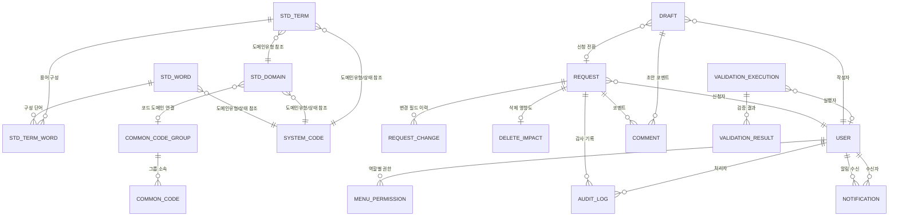
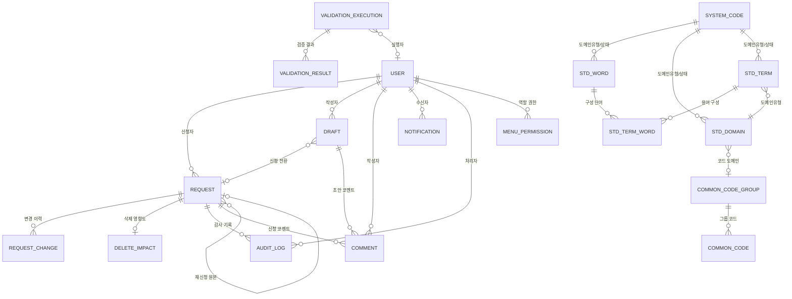
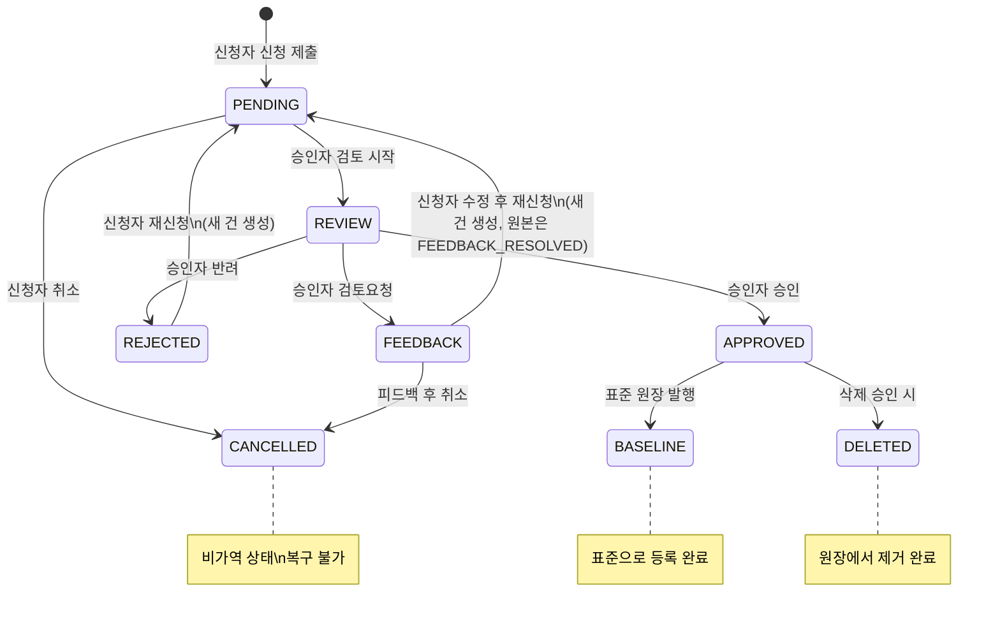
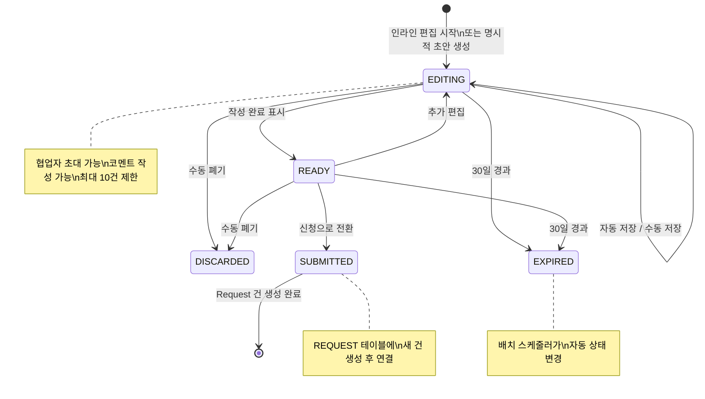
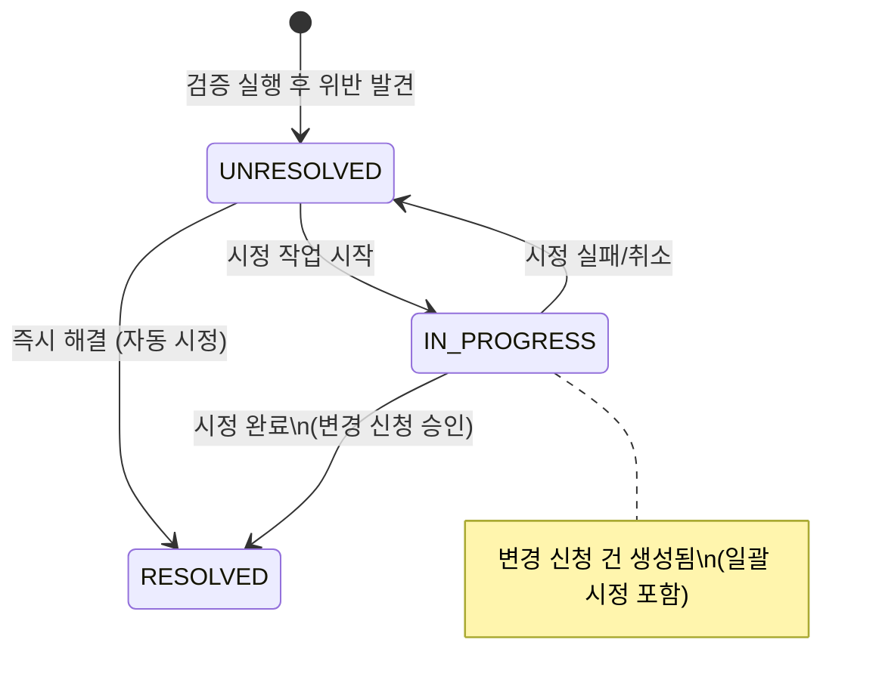

# Codex 데이터 아키텍처 명세

> **버전**: 1.0
> **작성일**: 2026-03-20
> **기준**: 6 Pillars 비전 기반 데이터 거버넌스 아키텍처
> **목적**: Codex 데이터 거버넌스 플랫폼의 데이터 모델, API, 비즈니스 규칙을 정의한다.

### 에이전트별 참조 가이드

| 에이전트               | 참조 섹션                                              | 설명                                           |
| ---------------------- | ------------------------------------------------------ | ---------------------------------------------- |
| **package-developer**  | 1. 데이터 모델 개요, 2. 엔티티 상세, 3. 엔티티 관계    | 엔티티 타입, enum, TypeScript 인터페이스 정의  |
| **backend-developer**  | 4. 상태 전이 다이어그램, 5. API 명세, 6. 비즈니스 규칙 | 118개 API 엔드포인트, 상태 머신, 비즈니스 규칙 |
| **frontend-developer** | 5. API 명세 (요청/응답 타입 참조)                      | API 클라이언트 구현 시 엔드포인트 사양 참조    |
| **code-reviewer**      | 6. 비즈니스 규칙, 7. 데이터 확장 고려사항              | 규칙 준수 검증, 무결성 제약 확인               |

---

## 1. 데이터 모델 개요

### 1.1 엔티티 총괄

| #   | 엔티티         | 테이블명             | 구분        | 비고            |
| --- | -------------- | -------------------- | ----------- | --------------- |
| 1   | 표준단어       | STD_WORD             | 핵심 도메인 | 기존            |
| 2   | 표준도메인     | STD_DOMAIN           | 핵심 도메인 | 기존            |
| 3   | 표준용어       | STD_TERM             | 핵심 도메인 | 기존            |
| 4   | 용어-단어 관계 | STD_TERM_WORD        | 핵심 도메인 | 기존            |
| 5   | 공통코드그룹   | COMMON_CODE_GROUP    | 공통코드    | 기존            |
| 6   | 공통코드       | COMMON_CODE          | 공통코드    | 기존            |
| 7   | 신청           | REQUEST              | 거버넌스    | 기존            |
| 8   | 신청변경이력   | REQUEST_CHANGE       | 거버넌스    | 기존            |
| 9   | 삭제영향도     | DELETE_IMPACT        | 거버넌스    | 기존            |
| 10  | 초안           | DRAFT                | 거버넌스    | **신규**        |
| 11  | 코멘트         | COMMENT              | 거버넌스    | **신규**        |
| 12  | 검증실행       | VALIDATION_EXECUTION | 검증        | 기존            |
| 13  | 검증결과       | VALIDATION_RESULT    | 검증        | 기존            |
| 14  | 사용자         | USER                 | 시스템      | 기존            |
| 15  | 메뉴권한       | MENU_PERMISSION      | 시스템      | 기존            |
| 16  | 시스템코드     | SYSTEM_CODE          | 시스템      | 기존            |
| 17  | 알림           | NOTIFICATION         | 시스템      | **신규**        |
| 18  | 감사이력       | AUDIT_LOG            | 시스템      | 기존            |
| 19  | DB연결         | DATABASE_CONNECTION  | 시스템      | 기존(명세 확장) |

### 1.2 ER 다이어그램



---

## 2. 엔티티 상세

> 모든 엔티티에는 공통 감사 필드가 포함된다. 아래 `BaseEntity`를 상속한다.

```typescript
/** 모든 엔티티의 공통 감사 필드 */
interface BaseEntity {
  createdAt: Date; // 생성일시
  createdBy: string; // 생성자 ID
  updatedAt: Date; // 수정일시
  updatedBy: string; // 수정자 ID
}
```

### 2.1 핵심 도메인 엔티티

#### StandardWord (표준단어)

> 조직 내 데이터 명칭의 최소 단위. 표준용어를 구성하는 기본 빌딩 블록.

```typescript
interface StandardWord extends BaseEntity {
  wordId: number; // PK, 자동 생성
  wordName: string; // 표준단어명 (한국어), max 100
  abbrName: string; // 영문약어 (대문자), max 50
  engName: string; // 영문명, max 200
  definition: string; // 정의 (TEXT)
  domainType: string | null; // 도메인유형 코드 (FK -> SYSTEM_CODE)
  status: StandardStatus; // 상태 코드
  regDate: Date; // 등록일
  modDate: Date | null; // 최종수정일
  regUserId: number; // 등록자 (FK -> USER)
}
```

| 필드       | DB 컬럼     | 타입         | 필수 | 제약조건                                   |
| ---------- | ----------- | ------------ | ---- | ------------------------------------------ |
| wordId     | WORD_ID     | BIGINT       | Y    | PK, AUTO_INCREMENT                         |
| wordName   | WORD_NAME   | VARCHAR(100) | Y    | UNIQUE(wordName)                           |
| abbrName   | ABBR_NAME   | VARCHAR(50)  | Y    | 대문자\_언더스코어만 허용, UNIQUE          |
| engName    | ENG_NAME    | VARCHAR(200) | Y    |                                            |
| definition | DEFINITION  | TEXT         | Y    |                                            |
| domainType | DOMAIN_TYPE | VARCHAR(20)  | N    | FK -> SYSTEM_CODE(CATEGORY='도메인유형')   |
| status     | STATUS      | VARCHAR(20)  | Y    | FK -> SYSTEM_CODE(CATEGORY='표준상태코드') |
| regDate    | REG_DATE    | DATE         | Y    | DEFAULT CURRENT_DATE                       |
| modDate    | MOD_DATE    | DATE         | N    | 변경 시 자동 갱신                          |
| regUserId  | REG_USER_ID | BIGINT       | Y    | FK -> USER(USER_ID)                        |

#### StandardDomain (표준도메인)

> 데이터 타입과 길이를 정의하는 단위. 표준용어에 데이터 규격을 부여한다.

```typescript
interface StandardDomain extends BaseEntity {
  domainId: number; // PK, 자동 생성
  domainName: string; // 도메인명, max 100
  domainType: string; // 도메인유형 (FK -> SYSTEM_CODE)
  dataType: DataType; // 데이터타입 (VARCHAR, CHAR, NUMBER, DATE, CLOB, BLOB)
  dataLength: string | null; // 데이터길이 (예: "100" 또는 "15,2")
  definition: string; // 정의 (TEXT)
  status: StandardStatus; // 상태 코드
  regDate: Date; // 등록일
  modDate: Date | null; // 최종수정일
  regUserId: number; // 등록자 (FK -> USER)
}

type DataType = "VARCHAR" | "CHAR" | "NUMBER" | "DATE" | "CLOB" | "BLOB";
```

| 필드       | DB 컬럼     | 타입         | 필수 | 제약조건                                             |
| ---------- | ----------- | ------------ | ---- | ---------------------------------------------------- |
| domainId   | DOMAIN_ID   | BIGINT       | Y    | PK, AUTO_INCREMENT                                   |
| domainName | DOMAIN_NAME | VARCHAR(100) | Y    | UNIQUE(domainName)                                   |
| domainType | DOMAIN_TYPE | VARCHAR(20)  | Y    | FK -> SYSTEM_CODE(CATEGORY='도메인유형')             |
| dataType   | DATA_TYPE   | VARCHAR(20)  | Y    | ENUM('VARCHAR','CHAR','NUMBER','DATE','CLOB','BLOB') |
| dataLength | DATA_LENGTH | VARCHAR(20)  | N    | 형식: 정수 또는 "정수,정수"                          |
| definition | DEFINITION  | TEXT         | Y    |                                                      |
| status     | STATUS      | VARCHAR(20)  | Y    | FK -> SYSTEM_CODE(CATEGORY='표준상태코드')           |
| regDate    | REG_DATE    | DATE         | Y    | DEFAULT CURRENT_DATE                                 |
| modDate    | MOD_DATE    | DATE         | N    |                                                      |
| regUserId  | REG_USER_ID | BIGINT       | Y    | FK -> USER(USER_ID)                                  |

#### StandardTerm (표준용어)

> 표준단어 + 표준도메인으로 구성된 비즈니스 용어. 물리명은 구성 단어 약어 조합으로 자동 생성.

```typescript
interface StandardTerm extends BaseEntity {
  termId: number; // PK, 자동 생성
  termName: string; // 표준용어명 (한국어), max 200
  physicalName: string; // 물리명 (영문, 자동 생성), max 200
  domainType: string; // 도메인유형 (FK -> SYSTEM_CODE)
  infoType: string; // 인포타입 (사용자명, 금액, 일자, 코드, 설명, 여부)
  definition: string; // 정의 (TEXT)
  status: StandardStatus; // 상태 코드
  regDate: Date; // 등록일
  modDate: Date | null; // 최종수정일
  regUserId: number; // 등록자 (FK -> USER)
}

type StandardStatus =
  | "UNREGISTERED" // 미등록
  | "PENDING" // 신청
  | "REVIEW" // 검토
  | "APPROVED" // 승인
  | "REJECTED" // 반려
  | "FEEDBACK" // 피드백대기
  | "CANCELLED" // 취소
  | "BASELINE" // 기존 (발행됨)
  | "DELETED"; // 삭제
```

| 필드         | DB 컬럼       | 타입         | 필수 | 제약조건                     |
| ------------ | ------------- | ------------ | ---- | ---------------------------- |
| termId       | TERM_ID       | BIGINT       | Y    | PK, AUTO_INCREMENT           |
| termName     | TERM_NAME     | VARCHAR(200) | Y    |                              |
| physicalName | PHYSICAL_NAME | VARCHAR(200) | Y    | 자동 생성 (readonly), UNIQUE |
| domainType   | DOMAIN_TYPE   | VARCHAR(20)  | Y    | FK -> SYSTEM_CODE            |
| infoType     | INFO_TYPE     | VARCHAR(50)  | Y    |                              |
| definition   | DEFINITION    | TEXT         | Y    |                              |
| status       | STATUS        | VARCHAR(20)  | Y    | FK -> SYSTEM_CODE            |
| regDate      | REG_DATE      | DATE         | Y    |                              |
| modDate      | MOD_DATE      | DATE         | N    |                              |
| regUserId    | REG_USER_ID   | BIGINT       | Y    | FK -> USER(USER_ID)          |

#### StandardTermWord (용어-단어 관계)

> 표준용어를 구성하는 표준단어의 순서 정보를 관리하는 관계 테이블.

```typescript
interface StandardTermWord {
  termId: number; // FK -> STD_TERM, 복합 PK
  wordId: number; // FK -> STD_WORD, 복합 PK
  seq: number; // 단어 순서
}
```

| 필드   | DB 컬럼 | 타입   | 필수 | 제약조건              |
| ------ | ------- | ------ | ---- | --------------------- |
| termId | TERM_ID | BIGINT | Y    | PK(1), FK -> STD_TERM |
| wordId | WORD_ID | BIGINT | Y    | PK(2), FK -> STD_WORD |
| seq    | SEQ     | INT    | Y    | >= 1                  |

### 2.2 거버넌스 엔티티

#### Request (신청)

> 모든 표준 변경(신규/변경/삭제)에 대한 거버넌스 파이프라인 진입점.

```typescript
interface Request extends BaseEntity {
  requestId: number; // PK, 자동 생성
  requestNo: string; // 신청번호 (표시용, REQ-yyyy-NNNN 형식)
  targetType: TargetType; // 대상 유형
  targetId: number | null; // 대상 엔티티 FK (변경/삭제 시)
  targetName: string; // 항목명
  requestType: RequestType; // 요청구분
  status: RequestStatus; // 상태
  requesterId: number; // 신청자 (FK -> USER)
  requestDate: Date; // 신청일
  processDate: Date | null; // 처리일
  requestReason: string | null; // 신청사유
  parentRequestId: number | null; // 원본 신청 ID (재신청 시)
}

type TargetType = "WORD" | "DOMAIN" | "TERM" | "COMMON_CODE";
type RequestType = "CREATE" | "UPDATE" | "DELETE";
type RequestStatus =
  | "PENDING" // 신청
  | "REVIEW" // 검토
  | "APPROVED" // 승인
  | "REJECTED" // 반려
  | "FEEDBACK" // 피드백대기
  | "CANCELLED" // 취소
  | "FEEDBACK_RESOLVED"; // 피드백반영
```

| 필드            | DB 컬럼           | 타입         | 필수 | 제약조건                                   |
| --------------- | ----------------- | ------------ | ---- | ------------------------------------------ |
| requestId       | REQUEST_ID        | BIGINT       | Y    | PK, AUTO_INCREMENT                         |
| requestNo       | REQUEST_NO        | VARCHAR(20)  | Y    | UNIQUE, 형식: REQ-yyyy-NNNN                |
| targetType      | TARGET_TYPE       | VARCHAR(20)  | Y    | ENUM('WORD','DOMAIN','TERM','COMMON_CODE') |
| targetId        | TARGET_ID         | BIGINT       | N    | 다형성 FK (신규 시 NULL)                   |
| targetName      | TARGET_NAME       | VARCHAR(200) | Y    |                                            |
| requestType     | REQUEST_TYPE      | VARCHAR(20)  | Y    | ENUM('CREATE','UPDATE','DELETE')           |
| status          | STATUS            | VARCHAR(20)  | Y    | 기본값 'PENDING'                           |
| requesterId     | REQUESTER_ID      | BIGINT       | Y    | FK -> USER(USER_ID)                        |
| requestDate     | REQUEST_DATE      | DATE         | Y    | DEFAULT CURRENT_DATE                       |
| processDate     | PROCESS_DATE      | DATE         | N    | 최종 처리 시 갱신                          |
| requestReason   | REQUEST_REASON    | TEXT         | N    |                                            |
| parentRequestId | PARENT_REQUEST_ID | BIGINT       | N    | FK -> REQUEST(REQUEST_ID)                  |

#### RequestChange (신청변경이력)

> 변경 신청 시 필드별 현재값/변경요청값을 기록하여 승인자에게 비교 뷰를 제공한다.

```typescript
interface RequestChange extends BaseEntity {
  changeId: number; // PK, 자동 생성
  requestId: number; // FK -> REQUEST
  fieldName: string; // 변경 필드명 (단어명, 영문약어, 영문명, 정의 등)
  oldValue: string | null; // 현재값
  newValue: string | null; // 변경요청값
}
```

| 필드      | DB 컬럼    | 타입        | 필수 | 제약조건                                     |
| --------- | ---------- | ----------- | ---- | -------------------------------------------- |
| changeId  | CHANGE_ID  | BIGINT      | Y    | PK, AUTO_INCREMENT                           |
| requestId | REQUEST_ID | BIGINT      | Y    | FK -> REQUEST(REQUEST_ID), ON DELETE CASCADE |
| fieldName | FIELD_NAME | VARCHAR(50) | Y    |                                              |
| oldValue  | OLD_VALUE  | TEXT        | N    |                                              |
| newValue  | NEW_VALUE  | TEXT        | N    |                                              |

#### DeleteImpact (삭제영향도)

> 삭제 신청 시 필수로 작성하는 영향도 평가서. 승인자의 판단 근거를 제공한다.

```typescript
interface DeleteImpact extends BaseEntity {
  impactId: number; // PK, 자동 생성
  requestId: number; // FK -> REQUEST (1:1)
  targetType: TargetType; // 대상 표준 유형
  targetId: number; // 대상 표준 FK
  affectedSystems: string | null; // 영향 시스템 (콤마 구분)
  affectedOther: string | null; // 기타 영향 영역
  impactLevel: ImpactLevel; // 영향도 수준
  impactDesc: string; // 영향도 설명
  altStandard: string | null; // 대체 표준 제안
  migrationPlan: string | null; // 마이그레이션 계획
  deleteReason: string; // 삭제 사유
}

type ImpactLevel = "HIGH" | "MEDIUM" | "LOW";
```

| 필드            | DB 컬럼          | 타입         | 필수 | 제약조건                                                   |
| --------------- | ---------------- | ------------ | ---- | ---------------------------------------------------------- |
| impactId        | IMPACT_ID        | BIGINT       | Y    | PK, AUTO_INCREMENT                                         |
| requestId       | REQUEST_ID       | BIGINT       | Y    | FK -> REQUEST, UNIQUE (1:1)                                |
| targetType      | TARGET_TYPE      | VARCHAR(20)  | Y    |                                                            |
| targetId        | TARGET_ID        | BIGINT       | Y    | 다형성 FK                                                  |
| affectedSystems | AFFECTED_SYSTEMS | VARCHAR(500) | N    | 값: 운영DB,DW,보고서/대시보드,API/인터페이스,외부연동,기타 |
| affectedOther   | AFFECTED_OTHER   | TEXT         | N    |                                                            |
| impactLevel     | IMPACT_LEVEL     | VARCHAR(10)  | Y    | ENUM('HIGH','MEDIUM','LOW')                                |
| impactDesc      | IMPACT_DESC      | TEXT         | Y    |                                                            |
| altStandard     | ALT_STANDARD     | VARCHAR(200) | N    |                                                            |
| migrationPlan   | MIGRATION_PLAN   | TEXT         | N    |                                                            |
| deleteReason    | DELETE_REASON    | TEXT         | Y    |                                                            |

#### Draft (초안) -- 신규

> 인라인 거버넌스와 초안/협업을 지원하는 핵심 엔티티. 사용자가 표준을 편집하면 자동으로 초안이 생성되고, 초안 완성 후 신청(Request)으로 전환된다.

```typescript
interface Draft extends BaseEntity {
  draftId: number; // PK, 자동 생성
  targetType: TargetType; // 대상 유형
  targetId: number | null; // 기존 표준 참조 (신규 시 NULL)
  title: string; // 초안 제목
  status: DraftStatus; // 초안 상태
  authorId: number; // 작성자 (FK -> USER)
  data: Record<string, unknown>; // 초안 데이터 (JSON)
  changesSummary: string | null; // 변경 요약 (자동 생성)
  requestId: number | null; // 신청 전환 시 연결 (FK -> REQUEST)
  collaboratorIds: number[]; // 협업자 목록 (JSON 배열)
  lastEditedAt: Date; // 최종 편집 일시
  autoSavedAt: Date | null; // 자동 저장 일시
  version: number; // 초안 버전 (낙관적 잠금)
}

type DraftStatus =
  | "EDITING" // 편집 중
  | "READY" // 신청 준비 완료
  | "SUBMITTED" // 신청으로 전환됨
  | "DISCARDED" // 사용자 수동 폐기
  | "EXPIRED"; // 30일 경과 자동 만료
```

| 필드            | DB 컬럼          | 타입         | 필수 | 제약조건                                   |
| --------------- | ---------------- | ------------ | ---- | ------------------------------------------ |
| draftId         | DRAFT_ID         | BIGINT       | Y    | PK, AUTO_INCREMENT                         |
| targetType      | TARGET_TYPE      | VARCHAR(20)  | Y    | ENUM('WORD','DOMAIN','TERM','COMMON_CODE') |
| targetId        | TARGET_ID        | BIGINT       | N    | 다형성 FK (신규 시 NULL)                   |
| title           | TITLE            | VARCHAR(200) | Y    |                                            |
| status          | STATUS           | VARCHAR(20)  | Y    | 기본값 'EDITING'                           |
| authorId        | AUTHOR_ID        | BIGINT       | Y    | FK -> USER(USER_ID)                        |
| data            | DATA             | JSON         | Y    | 초안 필드 데이터 (스키마 유연)             |
| expiresAt       | EXPIRES_AT       | TIMESTAMP    | Y    | 생성 후 30일, 초과 시 자동 EXPIRED         |
| changesSummary  | CHANGES_SUMMARY  | TEXT         | N    | 자동 diff 요약                             |
| requestId       | REQUEST_ID       | BIGINT       | N    | FK -> REQUEST(REQUEST_ID), 전환 후 설정    |
| collaboratorIds | COLLABORATOR_IDS | JSON         | N    | 사용자 ID 배열                             |
| lastEditedAt    | LAST_EDITED_AT   | TIMESTAMP    | Y    |                                            |
| autoSavedAt     | AUTO_SAVED_AT    | TIMESTAMP    | N    |                                            |
| version         | VERSION          | INT          | Y    | 기본값 1, 낙관적 잠금용                    |

#### Comment (코멘트) -- 신규

> 초안 및 신청에 대한 협업 코멘트. 인라인 리뷰와 피드백을 지원한다.

```typescript
interface Comment extends BaseEntity {
  commentId: number; // PK, 자동 생성
  targetType: CommentTarget; // 대상 유형 (DRAFT 또는 REQUEST)
  targetId: number; // 대상 ID (DRAFT_ID 또는 REQUEST_ID)
  authorId: number; // 작성자 (FK -> USER)
  content: string; // 코멘트 내용
  fieldName: string | null; // 인라인 코멘트 시 필드명 (NULL이면 일반 코멘트)
  parentCommentId: number | null; // 답글 시 부모 코멘트 ID
  isResolved: boolean; // 해결 여부
  resolvedBy: number | null; // 해결 처리자
  resolvedAt: Date | null; // 해결 일시
}

type CommentTarget = "DRAFT" | "REQUEST";
```

| 필드            | DB 컬럼           | 타입        | 필수 | 제약조건                             |
| --------------- | ----------------- | ----------- | ---- | ------------------------------------ |
| commentId       | COMMENT_ID        | BIGINT      | Y    | PK, AUTO_INCREMENT                   |
| targetType      | TARGET_TYPE       | VARCHAR(20) | Y    | ENUM('DRAFT','REQUEST')              |
| targetId        | TARGET_ID         | BIGINT      | Y    | 다형성 FK                            |
| authorId        | AUTHOR_ID         | BIGINT      | Y    | FK -> USER(USER_ID)                  |
| content         | CONTENT           | TEXT        | Y    |                                      |
| fieldName       | FIELD_NAME        | VARCHAR(50) | N    | NULL=일반 코멘트, 값=인라인 코멘트   |
| parentCommentId | PARENT_COMMENT_ID | BIGINT      | N    | FK -> COMMENT(COMMENT_ID), 자기 참조 |
| isResolved      | IS_RESOLVED       | BOOLEAN     | Y    | 기본값 FALSE                         |
| resolvedBy      | RESOLVED_BY       | BIGINT      | N    | FK -> USER(USER_ID)                  |
| resolvedAt      | RESOLVED_AT       | TIMESTAMP   | N    |                                      |

### 2.3 검증 엔티티

#### ValidationExecution (검증 실행)

> 검증 실행 단위. 전체 또는 유형별 검증을 실행하고 결과를 집계한다.

```typescript
interface ValidationExecution extends BaseEntity {
  executionId: number; // PK, 자동 생성
  execDatetime: Date; // 실행 일시
  targetScope: string; // 대상 범위 (전체, 표준단어 등)
  ruleCount: number; // 검증 규칙 수
  checkCount: number; // 검사 항목 수
  violationCount: number; // 위반 건수
  resultStatus: ValidationResultStatus; // 결과 상태
  executorId: number | null; // 실행자 (FK -> USER, NULL=시스템 자동)
}

type ValidationResultStatus = "CLEAN" | "VIOLATION_FOUND" | "PARTIAL_VIOLATION";
```

| 필드           | DB 컬럼         | 타입        | 필수 | 제약조건                         |
| -------------- | --------------- | ----------- | ---- | -------------------------------- |
| executionId    | EXECUTION_ID    | BIGINT      | Y    | PK, AUTO_INCREMENT               |
| execDatetime   | EXEC_DATETIME   | TIMESTAMP   | Y    |                                  |
| targetScope    | TARGET_SCOPE    | VARCHAR(50) | Y    |                                  |
| ruleCount      | RULE_COUNT      | INT         | Y    | >= 0                             |
| checkCount     | CHECK_COUNT     | INT         | Y    | >= 0                             |
| violationCount | VIOLATION_COUNT | INT         | Y    | >= 0                             |
| resultStatus   | RESULT_STATUS   | VARCHAR(20) | Y    |                                  |
| executorId     | EXECUTOR_ID     | BIGINT      | N    | FK -> USER(USER_ID), NULL=시스템 |

#### ValidationResult (검증결과)

> 개별 위반 항목. 검증 실행에서 발견된 규칙 위반 건을 기록한다.

```typescript
interface ValidationResult extends BaseEntity {
  resultId: number; // PK, 자동 생성
  executionId: number; // FK -> VALIDATION_EXECUTION
  execDatetime: Date; // 실행 일시 (비정규화)
  targetType: TargetType; // 대상 유형
  targetId: number; // 위반 항목 FK
  targetName: string; // 항목명
  ruleType: ValidationRuleType; // 위반 규칙
  violationDesc: string; // 위반 내용
  severity: Severity; // 심각도
  resolveStatus: ResolveStatus; // 처리 상태
  executorId: number | null; // 실행자
}

type ValidationRuleType =
  | "NAMING_RULE" // 명명규칙
  | "FORBIDDEN_WORD" // 금칙어
  | "DUPLICATE" // 중복
  | "REQUIRED_FIELD" // 필수항목
  | "LENGTH_LIMIT"; // 길이제한

type Severity = "HIGH" | "MEDIUM" | "LOW";
type ResolveStatus = "UNRESOLVED" | "IN_PROGRESS" | "RESOLVED";
```

| 필드          | DB 컬럼        | 타입         | 필수 | 제약조건                    |
| ------------- | -------------- | ------------ | ---- | --------------------------- |
| resultId      | RESULT_ID      | BIGINT       | Y    | PK, AUTO_INCREMENT          |
| executionId   | EXECUTION_ID   | BIGINT       | Y    | FK -> VALIDATION_EXECUTION  |
| execDatetime  | EXEC_DATETIME  | TIMESTAMP    | Y    |                             |
| targetType    | TARGET_TYPE    | VARCHAR(20)  | Y    |                             |
| targetId      | TARGET_ID      | BIGINT       | Y    | 다형성 FK                   |
| targetName    | TARGET_NAME    | VARCHAR(200) | Y    |                             |
| ruleType      | RULE_TYPE      | VARCHAR(30)  | Y    |                             |
| violationDesc | VIOLATION_DESC | TEXT         | Y    |                             |
| severity      | SEVERITY       | VARCHAR(10)  | Y    | ENUM('HIGH','MEDIUM','LOW') |
| resolveStatus | RESOLVE_STATUS | VARCHAR(20)  | Y    | 기본값 'UNRESOLVED'         |
| executorId    | EXECUTOR_ID    | BIGINT       | N    | FK -> USER(USER_ID)         |

### 2.4 공통코드 엔티티

#### CommonCodeGroup (공통코드그룹)

> 공통코드를 논리적으로 그룹화하는 상위 엔티티.

```typescript
interface CommonCodeGroup extends BaseEntity {
  groupId: number; // PK, 자동 생성
  groupCode: string; // 그룹코드 (영문, 예: TRADE_TYPE)
  groupName: string; // 코드그룹명
  codeCount: number; // 소속 코드 건수 (비정규화)
  status: StandardStatus; // 상태 코드
  regDate: Date; // 등록일
}
```

| 필드      | DB 컬럼    | 타입         | 필수 | 제약조건                         |
| --------- | ---------- | ------------ | ---- | -------------------------------- |
| groupId   | GROUP_ID   | BIGINT       | Y    | PK, AUTO_INCREMENT               |
| groupCode | GROUP_CODE | VARCHAR(50)  | Y    | UNIQUE, 영문\_언더스코어         |
| groupName | GROUP_NAME | VARCHAR(100) | Y    |                                  |
| codeCount | CODE_COUNT | INT          | N    | 기본값 0, 코드 추가/삭제 시 갱신 |
| status    | STATUS     | VARCHAR(20)  | Y    |                                  |
| regDate   | REG_DATE   | DATE         | Y    | DEFAULT CURRENT_DATE             |

#### CommonCode (공통코드)

> 공통코드그룹에 소속된 개별 코드값.

```typescript
interface CommonCode extends BaseEntity {
  codeId: number; // PK, 자동 생성
  groupId: number; // FK -> COMMON_CODE_GROUP
  code: string; // 코드값 (예: TRD001)
  codeName: string; // 코드명 (예: 매매)
  description: string | null; // 설명
  useYn: "Y" | "N"; // 사용여부
  status: StandardStatus; // 상태 코드
  regDate: Date; // 등록일
}
```

| 필드        | DB 컬럼     | 타입         | 필수 | 제약조건                          |
| ----------- | ----------- | ------------ | ---- | --------------------------------- |
| codeId      | CODE_ID     | BIGINT       | Y    | PK, AUTO_INCREMENT                |
| groupId     | GROUP_ID    | BIGINT       | Y    | FK -> COMMON_CODE_GROUP(GROUP_ID) |
| code        | CODE        | VARCHAR(50)  | Y    | UNIQUE(groupId, code)             |
| codeName    | CODE_NAME   | VARCHAR(100) | Y    |                                   |
| description | DESCRIPTION | TEXT         | N    |                                   |
| useYn       | USE_YN      | CHAR(1)      | Y    | ENUM('Y','N'), 기본값 'Y'         |
| status      | STATUS      | VARCHAR(20)  | Y    |                                   |
| regDate     | REG_DATE    | DATE         | Y    | DEFAULT CURRENT_DATE              |

### 2.5 시스템 엔티티

#### User (사용자)

> 시스템 사용자 계정. RBAC 기반 역할 할당.

```typescript
interface User extends BaseEntity {
  userId: number; // PK, 자동 생성
  loginId: string; // 사용자ID (로그인용)
  userName: string; // 이름
  password: string; // 비밀번호 (암호화 저장)
  role: UserRole; // 역할
  department: string | null; // 부서
  email: string | null; // 이메일
  lastLogin: Date | null; // 최종 로그인
  status: UserStatus; // 상태
}

type UserRole =
  | "SYSTEM_ADMIN" // 시스템관리자
  | "REVIEWER_APPROVER" // 검토/승인자
  | "STD_MANAGER" // 표준 관리자
  | "REQUESTER" // 신청자
  | "READ_ONLY"; // 조회전용

type UserStatus = "ACTIVE" | "INACTIVE";
```

| 필드       | DB 컬럼    | 타입         | 필수 | 제약조건            |
| ---------- | ---------- | ------------ | ---- | ------------------- |
| userId     | USER_ID    | BIGINT       | Y    | PK, AUTO_INCREMENT  |
| loginId    | LOGIN_ID   | VARCHAR(50)  | Y    | UNIQUE              |
| userName   | USER_NAME  | VARCHAR(100) | Y    |                     |
| password   | PASSWORD   | VARCHAR(256) | Y    | bcrypt/argon2 해시  |
| role       | ROLE       | VARCHAR(20)  | Y    |                     |
| department | DEPARTMENT | VARCHAR(100) | N    |                     |
| email      | EMAIL      | VARCHAR(200) | N    | 이메일 형식 검증    |
| lastLogin  | LAST_LOGIN | TIMESTAMP    | N    | 로그인 시 자동 갱신 |
| status     | STATUS     | VARCHAR(10)  | Y    | 기본값 'ACTIVE'     |

#### MenuPermission (메뉴권한)

> 역할별 메뉴 CRUD 권한. RBAC 매트릭스를 DB로 관리한다.

```typescript
interface MenuPermission extends BaseEntity {
  permId: number; // PK, 자동 생성
  role: UserRole; // 역할명
  menuCode: string; // 메뉴 코드
  canRead: boolean; // 조회 권한
  canCreate: boolean; // 등록 권한
  canUpdate: boolean; // 수정 권한
  canDelete: boolean; // 삭제 권한
}
```

| 필드      | DB 컬럼    | 타입        | 필수 | 제약조건               |
| --------- | ---------- | ----------- | ---- | ---------------------- |
| permId    | PERM_ID    | BIGINT      | Y    | PK, AUTO_INCREMENT     |
| role      | ROLE       | VARCHAR(20) | Y    | UNIQUE(role, menuCode) |
| menuCode  | MENU_CODE  | VARCHAR(50) | Y    |                        |
| canRead   | CAN_READ   | BOOLEAN     | Y    | 기본값 FALSE           |
| canCreate | CAN_CREATE | BOOLEAN     | Y    | 기본값 FALSE           |
| canUpdate | CAN_UPDATE | BOOLEAN     | Y    | 기본값 FALSE           |
| canDelete | CAN_DELETE | BOOLEAN     | Y    | 기본값 FALSE           |

#### SystemCode (시스템코드)

> 도메인유형, 표준상태코드, 요청구분코드 등 시스템 기준값을 관리한다.

```typescript
interface SystemCode extends BaseEntity {
  sysCodeId: number; // PK, 자동 생성
  category: string; // 카테고리 (도메인유형, 표준상태코드, 요청구분코드 등)
  code: string; // 코드 (STR, NUM, DT, CD 등)
  codeName: string; // 코드명 (문자열, 숫자, 일자 등)
  description: string | null; // 설명
  isProtected: boolean; // 보호 여부 (보호=수정/삭제 불가)
  regDate: Date; // 등록일
}
```

| 필드        | DB 컬럼      | 타입         | 필수 | 제약조건               |
| ----------- | ------------ | ------------ | ---- | ---------------------- |
| sysCodeId   | SYS_CODE_ID  | BIGINT       | Y    | PK, AUTO_INCREMENT     |
| category    | CATEGORY     | VARCHAR(30)  | Y    | UNIQUE(category, code) |
| code        | CODE         | VARCHAR(20)  | Y    |                        |
| codeName    | CODE_NAME    | VARCHAR(100) | Y    |                        |
| description | DESCRIPTION  | TEXT         | N    |                        |
| isProtected | IS_PROTECTED | BOOLEAN      | Y    | 기본값 FALSE           |
| regDate     | REG_DATE     | DATE         | Y    | DEFAULT CURRENT_DATE   |

#### Notification (알림) -- 신규

> 시스템 전역 UX를 위한 실시간 알림. 신청 상태 변경, 초안 코멘트, 검증 완료 등의 이벤트를 사용자에게 전달한다.

```typescript
interface Notification extends BaseEntity {
  notificationId: number; // PK, 자동 생성
  recipientId: number; // 수신자 (FK -> USER)
  type: NotificationType; // 알림 유형
  title: string; // 알림 제목
  message: string; // 알림 내용
  referenceType: string | null; // 참조 대상 유형 (REQUEST, DRAFT, VALIDATION 등)
  referenceId: number | null; // 참조 대상 ID
  isRead: boolean; // 읽음 여부
  readAt: Date | null; // 읽음 일시
  priority: NotificationPriority; // 우선순위
}

type NotificationType =
  | "REQUEST_STATUS_CHANGED" // 신청 상태 변경
  | "APPROVAL_REQUIRED" // 승인 요청 도착
  | "FEEDBACK_RECEIVED" // 피드백 수신
  | "COMMENT_ADDED" // 코멘트 추가
  | "DRAFT_SHARED" // 초안 공유
  | "VALIDATION_COMPLETED" // 검증 완료
  | "SYSTEM_ANNOUNCEMENT"; // 시스템 공지

type NotificationPriority = "HIGH" | "NORMAL" | "LOW";
```

| 필드           | DB 컬럼         | 타입         | 필수 | 제약조건                   |
| -------------- | --------------- | ------------ | ---- | -------------------------- |
| notificationId | NOTIFICATION_ID | BIGINT       | Y    | PK, AUTO_INCREMENT         |
| recipientId    | RECIPIENT_ID    | BIGINT       | Y    | FK -> USER(USER_ID), INDEX |
| type           | TYPE            | VARCHAR(30)  | Y    |                            |
| title          | TITLE           | VARCHAR(200) | Y    |                            |
| message        | MESSAGE         | TEXT         | Y    |                            |
| referenceType  | REFERENCE_TYPE  | VARCHAR(30)  | N    |                            |
| referenceId    | REFERENCE_ID    | BIGINT       | N    | 다형성 FK                  |
| isRead         | IS_READ         | BOOLEAN      | Y    | 기본값 FALSE, INDEX        |
| readAt         | READ_AT         | TIMESTAMP    | N    |                            |
| priority       | PRIORITY        | VARCHAR(10)  | Y    | 기본값 'NORMAL'            |

#### AuditLog (감사이력)

> 모든 의미 있는 상태 전환을 영구 기록하는 불변 로그.

```typescript
interface AuditLog {
  logId: number; // PK, 자동 생성
  logDatetime: Date; // 이벤트 일시
  targetType: TargetType; // 대상 유형
  targetName: string; // 대상명
  targetId: number | null; // 대상 엔티티 FK
  actionType: ActionType; // 작업 유형
  stateFrom: string | null; // 이전 상태
  stateTo: string | null; // 이후 상태
  actorId: number; // 처리자 (FK -> USER)
  actorRole: string | null; // 처리자 역할
  comment: string | null; // 사유/코멘트
  requestId: number | null; // 관련 신청 FK
}

type ActionType =
  | "REQUEST" // 신청
  | "REVIEW" // 검토
  | "APPROVE" // 승인
  | "REJECT" // 반려
  | "CANCEL" // 취소
  | "FEEDBACK" // 검토요청
  | "CREATE" // 생성
  | "UPDATE" // 수정
  | "DELETE"; // 삭제
```

| 필드        | DB 컬럼      | 타입         | 필수 | 제약조건                         |
| ----------- | ------------ | ------------ | ---- | -------------------------------- |
| logId       | LOG_ID       | BIGINT       | Y    | PK, AUTO_INCREMENT               |
| logDatetime | LOG_DATETIME | TIMESTAMP    | Y    | DEFAULT CURRENT_TIMESTAMP, INDEX |
| targetType  | TARGET_TYPE  | VARCHAR(20)  | Y    | INDEX                            |
| targetName  | TARGET_NAME  | VARCHAR(200) | Y    |                                  |
| targetId    | TARGET_ID    | BIGINT       | N    | 다형성 FK                        |
| actionType  | ACTION_TYPE  | VARCHAR(20)  | Y    | INDEX                            |
| stateFrom   | STATE_FROM   | VARCHAR(20)  | N    |                                  |
| stateTo     | STATE_TO     | VARCHAR(20)  | N    |                                  |
| actorId     | ACTOR_ID     | BIGINT       | Y    | FK -> USER(USER_ID)              |
| actorRole   | ACTOR_ROLE   | VARCHAR(50)  | N    |                                  |
| comment     | COMMENT      | TEXT         | N    |                                  |
| requestId   | REQUEST_ID   | BIGINT       | N    | FK -> REQUEST(REQUEST_ID)        |

> 감사이력은 INSERT ONLY -- UPDATE/DELETE 금지 (불변).

#### DatabaseConnection (DB연결)

> 표준관리 DB 접속 정보 및 SSH 터널링 설정.

```typescript
interface DatabaseConnection extends BaseEntity {
  connectionId: number; // PK, 자동 생성
  dbType: DbType; // DB 유형
  host: string; // 호스트
  port: number; // 포트
  databaseName: string; // 데이터베이스/SID
  username: string; // 사용자명
  password: string; // 비밀번호 (암호화 저장)
  schema: string | null; // 스키마
  charset: string; // 문자셋
  sshEnabled: boolean; // SSH 터널링 사용 여부
  sshHost: string | null; // SSH 호스트
  sshPort: number | null; // SSH 포트
  sshUsername: string | null; // SSH 사용자명
  sshAuthType: SshAuthType | null; // SSH 인증방식
  sshPassword: string | null; // SSH 비밀번호 (암호화 저장)
  sshKeyPath: string | null; // SSH 키 경로
  isActive: boolean; // 활성 연결 여부
}

type DbType = "ORACLE" | "POSTGRESQL" | "MYSQL" | "MSSQL";
type SshAuthType = "PASSWORD" | "SSH_KEY";
```

| 필드         | DB 컬럼       | 타입         | 필수 | 제약조건                                    |
| ------------ | ------------- | ------------ | ---- | ------------------------------------------- |
| connectionId | CONNECTION_ID | BIGINT       | Y    | PK, AUTO_INCREMENT                          |
| dbType       | DB_TYPE       | VARCHAR(20)  | Y    | ENUM('ORACLE','POSTGRESQL','MYSQL','MSSQL') |
| host         | HOST          | VARCHAR(200) | Y    |                                             |
| port         | PORT          | INT          | Y    | 범위: 1-65535                               |
| databaseName | DATABASE_NAME | VARCHAR(100) | Y    |                                             |
| username     | USERNAME      | VARCHAR(100) | Y    |                                             |
| password     | PASSWORD      | VARCHAR(256) | Y    | AES-256 암호화                              |
| schema       | SCHEMA_NAME   | VARCHAR(100) | N    |                                             |
| charset      | CHARSET       | VARCHAR(20)  | Y    | ENUM('UTF-8','EUC-KR','ASCII')              |
| sshEnabled   | SSH_ENABLED   | BOOLEAN      | Y    | 기본값 FALSE                                |
| sshHost      | SSH_HOST      | VARCHAR(200) | N    | sshEnabled=TRUE 시 필수                     |
| sshPort      | SSH_PORT      | INT          | N    | 범위: 1-65535                               |
| sshUsername  | SSH_USERNAME  | VARCHAR(100) | N    |                                             |
| sshAuthType  | SSH_AUTH_TYPE | VARCHAR(20)  | N    | ENUM('PASSWORD','SSH_KEY')                  |
| sshPassword  | SSH_PASSWORD  | VARCHAR(256) | N    | AES-256 암호화                              |
| sshKeyPath   | SSH_KEY_PATH  | VARCHAR(500) | N    |                                             |
| isActive     | IS_ACTIVE     | BOOLEAN      | Y    | 기본값 TRUE                                 |

---

## 3. 엔티티 관계 (Relationships)

### 3.1 관계 다이어그램



### 3.2 관계 설명 테이블

| 관계                                      | 카디널리티 | 설명                                      | FK 위치                                   |
| ----------------------------------------- | ---------- | ----------------------------------------- | ----------------------------------------- |
| STD_TERM <-> STD_WORD                     | N:M        | 용어는 1개 이상의 단어로 구성             | STD_TERM_WORD (중간 테이블)               |
| STD_TERM -> STD_DOMAIN                    | N:1        | 용어는 1개 도메인유형을 참조              | STD_TERM.DOMAIN_TYPE                      |
| STD_DOMAIN -> COMMON_CODE_GROUP           | N:0..1     | 도메인유형이 '코드(공통코드)'인 경우 연결 | 논리적 참조                               |
| COMMON_CODE_GROUP -> COMMON_CODE          | 1:N        | 그룹에 소속된 코드 목록                   | COMMON_CODE.GROUP_ID                      |
| USER -> REQUEST                           | 1:N        | 사용자가 신청을 생성                      | REQUEST.REQUESTER_ID                      |
| REQUEST -> REQUEST_CHANGE                 | 1:N        | 변경 신청의 필드별 변경 이력              | REQUEST_CHANGE.REQUEST_ID                 |
| REQUEST -> DELETE_IMPACT                  | 1:0..1     | 삭제 신청의 영향도 평가                   | DELETE_IMPACT.REQUEST_ID                  |
| REQUEST -> AUDIT_LOG                      | 1:N        | 신청 상태 전환마다 감사 기록              | AUDIT_LOG.REQUEST_ID                      |
| REQUEST -> REQUEST (자기 참조)            | N:0..1     | 재신청 시 원본 신청 참조                  | REQUEST.PARENT_REQUEST_ID                 |
| REQUEST -> COMMENT                        | 1:N        | 신청에 대한 코멘트                        | COMMENT.TARGET_ID (TARGET_TYPE='REQUEST') |
| USER -> DRAFT                             | 1:N        | 사용자가 초안을 생성                      | DRAFT.AUTHOR_ID                           |
| DRAFT -> REQUEST                          | 0..1:0..1  | 초안이 신청으로 전환                      | DRAFT.REQUEST_ID                          |
| DRAFT -> COMMENT                          | 1:N        | 초안에 대한 코멘트                        | COMMENT.TARGET_ID (TARGET_TYPE='DRAFT')   |
| COMMENT -> COMMENT (자기 참조)            | N:0..1     | 답글 스레드                               | COMMENT.PARENT_COMMENT_ID                 |
| USER -> NOTIFICATION                      | 1:N        | 사용자에게 전달된 알림                    | NOTIFICATION.RECIPIENT_ID                 |
| VALIDATION_EXECUTION -> VALIDATION_RESULT | 1:N        | 검증 실행의 개별 결과                     | VALIDATION_RESULT.EXECUTION_ID            |
| USER -> MENU_PERMISSION                   | 역할:N     | 역할별 메뉴 권한                          | MENU_PERMISSION.ROLE                      |
| SYSTEM_CODE -> STD_WORD/DOMAIN/TERM       | 1:N        | 도메인유형/상태코드 참조                  | 각 엔티티의 DOMAIN_TYPE, STATUS           |

---

## 4. 상태 전이 다이어그램

### 4.1 신청(Request) 상태 전이



**전이 규칙:**

| 현재 상태 | 허용 전이       | 수행자 | 조건                       |
| --------- | --------------- | ------ | -------------------------- |
| PENDING   | REVIEW          | 승인자 | 신청자 본인 건 제외        |
| PENDING   | CANCELLED       | 신청자 | 본인 신청 건만             |
| REVIEW    | APPROVED        | 승인자 | 처리사유 필수              |
| REVIEW    | REJECTED        | 승인자 | 처리사유 필수              |
| REVIEW    | FEEDBACK        | 승인자 | 처리사유 필수              |
| FEEDBACK  | PENDING (새 건) | 신청자 | 수정 후 새 건 생성         |
| FEEDBACK  | CANCELLED       | 신청자 |                            |
| REJECTED  | PENDING (새 건) | 신청자 | 새 건 생성                 |
| APPROVED  | BASELINE        | 시스템 | 자동 전이 (신규/변경 승인) |
| APPROVED  | DELETED         | 시스템 | 자동 전이 (삭제 승인)      |

### 4.2 초안(Draft) 상태 전이



**전이 규칙:**

| 현재 상태 | 허용 전이 | 수행자        | 조건                           |
| --------- | --------- | ------------- | ------------------------------ |
| EDITING   | READY     | 작성자/협업자 | 필수 필드 입력 완료            |
| EDITING   | DISCARDED | 작성자        | 수동 폐기                      |
| EDITING   | EXPIRED   | 시스템        | expiresAt 경과 (배치 스케줄러) |
| READY     | EDITING   | 작성자/협업자 |                                |
| READY     | SUBMITTED | 작성자        | 신청 제출, REQUEST 생성        |
| READY     | DISCARDED | 작성자        | 수동 폐기                      |
| READY     | EXPIRED   | 시스템        | expiresAt 경과 (배치 스케줄러) |

### 4.3 검증(Validation) 상태 전이



---

## 5. API 명세

### 5.0 공통 규격

- **Base URL**: `/api`
- **인증**: 세션 기반 (로그인 후 쿠키/토큰), Authorization 헤더
- **응답 포맷**: JSON (`Content-Type: application/json`)
- **페이지네이션**: `?page=1&size=10`
- **정렬**: `?sort=fieldName&order=asc|desc`
- **에러 응답**: `{ error: { code: string, message: string, details?: object } }`

```typescript
/** 공통 페이지네이션 응답 */
interface PaginatedResponse<T> {
  items: T[];
  total: number;
  page: number;
  size: number;
  totalPages: number;
}

/** 공통 에러 응답 */
interface ErrorResponse {
  error: {
    code: string;
    message: string;
    details?: Record<string, string>;
  };
}
```

### 5.1 인증 API

| Method | Path                | 설명             | 권한      |
| ------ | ------------------- | ---------------- | --------- |
| POST   | `/api/auth/login`   | 로그인           | 공개      |
| POST   | `/api/auth/logout`  | 로그아웃         | 인증 필요 |
| GET    | `/api/auth/session` | 세션/프로필 확인 | 인증 필요 |

**POST `/api/auth/login`**

```typescript
// Request
interface LoginRequest {
  loginId: string;
  password: string;
}

// Response 200
interface LoginResponse {
  user: {
    userId: number;
    loginId: string;
    userName: string;
    role: UserRole;
    department: string | null;
  };
  token: string;
  expiresAt: string; // ISO 8601
}
```

**GET `/api/auth/session`**

```typescript
// Response 200
interface SessionResponse {
  user: {
    userId: number;
    loginId: string;
    userName: string;
    role: UserRole;
    department: string | null;
    email: string | null;
  };
  permissions: MenuPermission[];
}
```

### 5.2 대시보드 API

> Pillar 4 (역할 적응형 대시보드) -- 역할에 따라 반환 데이터가 달라진다.

| Method | Path                             | 설명           | 권한             |
| ------ | -------------------------------- | -------------- | ---------------- |
| GET    | `/api/dashboard/stats`           | 표준 건수 통계 | 모든 인증 사용자 |
| GET    | `/api/dashboard/pending`         | 승인 대기 건수 | 승인자 이상      |
| GET    | `/api/dashboard/recent-activity` | 최근 활동      | 모든 인증 사용자 |
| GET    | `/api/dashboard/trend`           | 월별 등록 추이 | 모든 인증 사용자 |
| GET    | `/api/dashboard/my-summary`      | 내 활동 요약   | 모든 인증 사용자 |
| GET    | `/api/dashboard/role-kpi`        | 역할별 KPI     | 모든 인증 사용자 |

**GET `/api/dashboard/stats`**

```typescript
// Response 200
interface DashboardStats {
  words: { total: number; monthChange: number };
  domains: { total: number; monthChange: number };
  terms: { total: number; monthChange: number };
  commonCodes: { total: number; monthChange: number };
}
```

**GET `/api/dashboard/role-kpi`**

```typescript
// Response 200 (역할별 차별화)
interface RoleKpi {
  role: UserRole;
  kpis: {
    // 승인자용
    pendingApprovals?: number;
    avgProcessingDays?: number;
    approvalRate?: number;
    // 신청자용
    myPendingCount?: number;
    myApprovedCount?: number;
    myRejectedCount?: number;
    // 공통
    complianceRate: number;
    totalViolations: number;
  };
}
```

### 5.3 통합 탐색기 API (검색/필터/페이지네이션)

> Pillar 1 (통합 표준 탐색기) -- 3개 엔티티(표준용어/도메인/단어)를 통합 검색하는 API.

| Method | Path                         | 설명            | 권한             |
| ------ | ---------------------------- | --------------- | ---------------- |
| GET    | `/api/explorer/search`       | 통합 검색       | 모든 인증 사용자 |
| GET    | `/api/explorer/facets`       | 패싯 필터 옵션  | 모든 인증 사용자 |
| GET    | `/api/explorer/autocomplete` | 검색어 자동완성 | 모든 인증 사용자 |

**GET `/api/explorer/search`**

```typescript
// Query Parameters
interface ExplorerSearchParams {
  keyword?: string; // 검색어 (이름, 약어, 정의 전문 검색)
  types?: TargetType[]; // 대상 유형 필터 (복수 선택)
  domainType?: string; // 도메인유형 필터
  status?: StandardStatus[]; // 상태 필터 (복수 선택)
  infoType?: string; // 인포타입 필터 (용어 전용)
  dateFrom?: string; // 등록일 범위 시작 (ISO 8601)
  dateTo?: string; // 등록일 범위 종료
  page?: number; // 기본값 1
  size?: number; // 기본값 10, 최대 100
  sort?: string; // 정렬 필드 (name, regDate, status)
  order?: "asc" | "desc"; // 정렬 방향 (기본값 asc)
}

// Response 200
interface ExplorerSearchResponse {
  items: ExplorerItem[];
  total: number;
  page: number;
  size: number;
  totalPages: number;
  facets: {
    types: { type: TargetType; count: number }[];
    domainTypes: { code: string; name: string; count: number }[];
    statuses: { status: StandardStatus; count: number }[];
  };
}

interface ExplorerItem {
  id: number;
  type: TargetType; // WORD | DOMAIN | TERM
  name: string; // 표준명
  abbrName?: string; // 영문약어 (단어만)
  physicalName?: string; // 물리명 (용어만)
  domainType: string; // 도메인유형
  definition: string; // 정의 (하이라이트 포함)
  status: StandardStatus;
  regDate: string;
  regUserName: string;
  highlightedFields?: Record<string, string>; // 검색어 매칭 하이라이트
}
```

**GET `/api/explorer/autocomplete`**

```typescript
// Query Parameters
interface AutocompleteParams {
  q: string; // 검색어 (최소 2자)
  types?: TargetType[];
  limit?: number; // 기본값 5, 최대 10
}

// Response 200
interface AutocompleteResponse {
  suggestions: {
    text: string;
    type: TargetType;
    id: number;
    matchField: string; // name, abbrName, physicalName
  }[];
}
```

### 5.4 표준 CRUD API

| Method | Path                                  | 설명            | 권한             |
| ------ | ------------------------------------- | --------------- | ---------------- |
| GET    | `/api/standards/words`                | 표준단어 목록   | 모든 인증 사용자 |
| GET    | `/api/standards/words/{id}`           | 표준단어 상세   | 모든 인증 사용자 |
| GET    | `/api/standards/words/{id}/terms`     | 관련 용어       | 모든 인증 사용자 |
| GET    | `/api/standards/words/{id}/history`   | 변경 이력       | 모든 인증 사용자 |
| GET    | `/api/standards/domains`              | 표준도메인 목록 | 모든 인증 사용자 |
| GET    | `/api/standards/domains/{id}`         | 표준도메인 상세 | 모든 인증 사용자 |
| GET    | `/api/standards/domains/{id}/terms`   | 관련 용어       | 모든 인증 사용자 |
| GET    | `/api/standards/domains/{id}/history` | 변경 이력       | 모든 인증 사용자 |
| GET    | `/api/standards/terms`                | 표준용어 목록   | 모든 인증 사용자 |
| GET    | `/api/standards/terms/{id}`           | 표준용어 상세   | 모든 인증 사용자 |
| GET    | `/api/standards/terms/{id}/words`     | 구성 단어       | 모든 인증 사용자 |
| GET    | `/api/standards/terms/{id}/domain`    | 사용 도메인     | 모든 인증 사용자 |
| GET    | `/api/standards/terms/{id}/history`   | 변경 이력       | 모든 인증 사용자 |

**GET `/api/standards/words`**

```typescript
// Query Parameters
interface WordListParams {
  keyword?: string;
  status?: string;
  domainType?: string;
  page?: number;
  size?: number;
  sort?: string;
  order?: "asc" | "desc";
}

// Response 200
type WordListResponse = PaginatedResponse<StandardWord>;
```

**GET `/api/standards/words/{id}`**

```typescript
// Response 200
interface WordDetailResponse extends StandardWord {
  regUserName: string;
  relatedTermCount: number;
  domainTypeName: string | null;
  statusName: string;
}
```

### 5.5 거버넌스 API (신청/승인/반려)

| Method | Path                          | 설명                | 권한             |
| ------ | ----------------------------- | ------------------- | ---------------- |
| POST   | `/api/requests/words`         | 표준단어 신청       | 신청자 이상      |
| POST   | `/api/requests/domains`       | 표준도메인 신청     | 신청자 이상      |
| POST   | `/api/requests/terms`         | 표준용어 신청       | 신청자 이상      |
| POST   | `/api/requests/common-codes`  | 공통코드 신청       | 표준 관리자 이상 |
| GET    | `/api/requests`               | 전체 신청 목록      | 신청자 이상      |
| GET    | `/api/requests/my`            | 내 신청 목록        | 신청자 이상      |
| GET    | `/api/requests/my/stats`      | 내 신청 통계        | 신청자 이상      |
| GET    | `/api/requests/{id}`          | 신청 상세           | 신청자 이상      |
| GET    | `/api/requests/{id}/feedback` | 피드백 상세         | 신청자 이상      |
| PATCH  | `/api/requests/{id}/cancel`   | 신청 취소           | 신청자 (본인 건) |
| POST   | `/api/requests/{type}/delete` | 삭제 신청 + 영향도  | 신청자 이상      |
| GET    | `/api/approvals`              | 승인 대기 목록      | 승인자 이상      |
| GET    | `/api/approvals/stats`        | 승인 통계           | 승인자 이상      |
| GET    | `/api/approvals/{id}`         | 신청 상세 (승인 뷰) | 승인자 이상      |
| GET    | `/api/approvals/{id}/changes` | 변경 전후 비교      | 승인자 이상      |
| GET    | `/api/approvals/{id}/history` | 처리 이력           | 승인자 이상      |
| POST   | `/api/approvals/{id}/process` | 승인/반려/검토요청  | 승인자 이상      |
| POST   | `/api/approvals/batch`        | 일괄 처리           | 승인자 이상      |

**POST `/api/requests/words`**

```typescript
// Request
interface CreateWordRequest {
  wordName: string;
  abbrName: string;
  engName: string;
  definition: string;
  domainType?: string;
  requestType: RequestType;
  reason?: string;
  targetId?: number; // 변경 시 기존 단어 ID
}

// Response 201
interface CreateRequestResponse {
  requestId: number;
  requestNo: string;
  status: "PENDING";
}
```

**POST `/api/approvals/{id}/process`**

```typescript
// Request
interface ProcessApprovalRequest {
  action: "approve" | "reject" | "feedback";
  reason: string; // 필수
}

// Response 200
interface ProcessApprovalResponse {
  requestId: number;
  status: RequestStatus;
  processDate: string;
}
```

**POST `/api/approvals/batch`**

```typescript
// Request
interface BatchApprovalRequest {
  ids: number[];
  action: "approve" | "reject";
  reason: string; // 필수
}

// Response 200
interface BatchApprovalResponse {
  processed: number;
  results: {
    requestId: number;
    status: RequestStatus;
    success: boolean;
    error?: string;
  }[];
}
```

### 5.6 인라인 거버넌스 API (편집 -> 자동 신청)

> Pillar 2 (인라인 거버넌스) -- 사용자가 상세 페이지에서 직접 필드를 편집하면 자동으로 Draft가 생성되고, 확인 후 Request로 전환되는 데이터 플로우.

| Method | Path                                      | 설명                               | 권한          |
| ------ | ----------------------------------------- | ---------------------------------- | ------------- |
| POST   | `/api/inline-governance/edit`             | 인라인 편집 시작 (Draft 자동 생성) | 신청자 이상   |
| PATCH  | `/api/inline-governance/{draftId}/field`  | 개별 필드 업데이트                 | 작성자/협업자 |
| POST   | `/api/inline-governance/{draftId}/submit` | 초안 -> 신청 전환                  | 작성자        |
| GET    | `/api/inline-governance/{draftId}/diff`   | 변경 사항 미리보기                 | 작성자/협업자 |

**POST `/api/inline-governance/edit`**

```typescript
// Request
interface InlineEditRequest {
  targetType: TargetType;
  targetId: number; // 편집 대상 표준 ID
}

// Response 201
interface InlineEditResponse {
  draftId: number;
  status: "EDITING";
  originalData: Record<string, unknown>; // 현재 표준 데이터
}
```

**데이터 플로우:**

```markdown
1. 사용자가 상세 페이지에서 "편집" 클릭
2. POST /api/inline-governance/edit -> Draft(EDITING) 생성
3. 사용자가 필드를 수정할 때마다:
   PATCH /api/inline-governance/{draftId}/field -> Draft.data 업데이트
   (자동 저장: 300ms 디바운스 — 타이핑 멈춤 후 자동 저장 + 필드 blur 이벤트 시 즉시 저장)
4. 사용자가 "신청" 클릭:
   POST /api/inline-governance/{draftId}/submit
   -> Draft 상태: EDITING -> SUBMITTED
   -> Request 건 자동 생성 (CREATE/UPDATE/DELETE)
   -> RequestChange 레코드 자동 생성 (변경된 필드만)
   -> AuditLog 기록
   -> Notification 생성 (승인자에게)
```

**PATCH `/api/inline-governance/{draftId}/field`**

```typescript
// Request
interface InlineFieldUpdateRequest {
  fieldName: string;
  value: unknown;
}

// Response 200
interface InlineFieldUpdateResponse {
  draftId: number;
  fieldName: string;
  autoSavedAt: string;
  version: number;
}
```

**POST `/api/inline-governance/{draftId}/submit`**

```typescript
// Request
interface InlineSubmitRequest {
  reason?: string; // 신청사유
  requestType: RequestType; // 신규/변경/삭제
}

// Response 201
interface InlineSubmitResponse {
  requestId: number;
  requestNo: string;
  draftId: number;
  changes: {
    fieldName: string;
    oldValue: unknown;
    newValue: unknown;
  }[];
}
```

### 5.7 초안 & 협업 API

> Pillar 5 (초안 & 협업) -- Draft CRUD 및 협업 기능.

| Method | Path                                      | 설명                                        | 권한          |
| ------ | ----------------------------------------- | ------------------------------------------- | ------------- |
| GET    | `/api/drafts`                             | 내 초안 목록                                | 신청자 이상   |
| POST   | `/api/drafts`                             | 초안 생성 (사용자당 최대 10건, 초과 시 422) | 신청자 이상   |
| GET    | `/api/drafts/{id}`                        | 초안 상세                                   | 작성자/협업자 |
| PUT    | `/api/drafts/{id}`                        | 초안 전체 저장                              | 작성자/협업자 |
| PATCH  | `/api/drafts/{id}/status`                 | 초안 상태 변경                              | 작성자        |
| DELETE | `/api/drafts/{id}`                        | 초안 삭제 (DISCARDED)                       | 작성자        |
| POST   | `/api/drafts/{id}/collaborators`          | 협업자 초대                                 | 작성자        |
| DELETE | `/api/drafts/{id}/collaborators/{userId}` | 협업자 제거                                 | 작성자        |
| POST   | `/api/drafts/{id}/submit`                 | 초안 -> 신청 전환                           | 작성자        |
| GET    | `/api/comments`                           | 코멘트 목록                                 | 작성자/협업자 |
| POST   | `/api/comments`                           | 코멘트 작성                                 | 신청자 이상   |
| PUT    | `/api/comments/{id}`                      | 코멘트 수정                                 | 작성자 본인   |
| DELETE | `/api/comments/{id}`                      | 코멘트 삭제                                 | 작성자 본인   |
| PATCH  | `/api/comments/{id}/resolve`              | 코멘트 해결 처리                            | 작성자/협업자 |

**POST `/api/drafts`**

```typescript
// Request
interface CreateDraftRequest {
  targetType: TargetType;
  targetId?: number; // 기존 표준 기반 시
  title: string;
  data: Record<string, unknown>;
}

// Response 201
interface CreateDraftResponse {
  draftId: number;
  status: "EDITING";
  version: 1;
}
```

**POST `/api/comments`**

```typescript
// Request
interface CreateCommentRequest {
  targetType: CommentTarget; // DRAFT | REQUEST
  targetId: number;
  content: string;
  fieldName?: string; // 인라인 코멘트 시
  parentCommentId?: number; // 답글 시
}

// Response 201
interface CreateCommentResponse {
  commentId: number;
  createdAt: string;
}
```

### 5.8 검증 API

| Method | Path                                        | 설명                    | 권한               |
| ------ | ------------------------------------------- | ----------------------- | ------------------ |
| GET    | `/api/validations/summary`                  | 위반 통계 (유형별 건수) | 모든 인증 사용자   |
| GET    | `/api/validations/trend`                    | 월별 위반 추이          | 모든 인증 사용자   |
| GET    | `/api/validations/rules`                    | 규칙별 위반 현황        | 모든 인증 사용자   |
| GET    | `/api/validations/history`                  | 검증 실행 이력          | 모든 인증 사용자   |
| POST   | `/api/validations/execute`                  | 검증 실행               | 관리자/표준 관리자 |
| GET    | `/api/validations/violations`               | 위반 항목 목록          | 모든 인증 사용자   |
| POST   | `/api/validations/violations/batch-correct` | 일괄 시정 신청          | 신청자 이상        |

**POST `/api/validations/execute`**

```typescript
// Request
interface ExecuteValidationRequest {
  targetScope?: string; // "ALL" | "WORD" | "DOMAIN" | "TERM" (기본값 ALL)
  ruleTypes?: ValidationRuleType[]; // 특정 규칙만 실행 (생략 시 전체)
}

// Response 202 (비동기 처리)
interface ExecuteValidationResponse {
  executionId: number;
  status: "RUNNING";
  estimatedDuration: number; // 예상 소요 시간 (초)
}
```

**GET `/api/validations/violations`**

```typescript
// Query Parameters
interface ViolationListParams {
  ruleType?: ValidationRuleType;
  targetType?: TargetType;
  severity?: Severity;
  resolveStatus?: ResolveStatus;
  keyword?: string;
  page?: number;
  size?: number;
}

// Response 200
type ViolationListResponse = PaginatedResponse<ValidationResult>;
```

### 5.9 AI Data Butler API

> Pillar 3 (AI Data Butler 2.0) -- AI 기반 추천, 자동완성, 유사어 검색, 품질 점수 평가.

| Method | Path                                | 설명                          | 권한             |
| ------ | ----------------------------------- | ----------------------------- | ---------------- |
| GET    | `/api/ai/suggest`                   | AI 유사 표준 추천             | 모든 인증 사용자 |
| GET    | `/api/ai/suggest/{id}/match-detail` | 매칭 근거 상세                | 모든 인증 사용자 |
| POST   | `/api/ai/autocomplete`              | AI 자동완성 (정의, 영문명 등) | 신청자 이상      |
| POST   | `/api/ai/quality-score`             | 품질 점수 평가                | 모든 인증 사용자 |
| GET    | `/api/ai/synonyms`                  | 유사어/동의어 검색            | 모든 인증 사용자 |
| POST   | `/api/ai/generate-physical-name`    | 물리명 자동 생성              | 신청자 이상      |
| POST   | `/api/ai/validate-naming`           | 명명 규칙 실시간 검증         | 신청자 이상      |

**GET `/api/ai/suggest`**

```typescript
// Query Parameters
interface AiSuggestParams {
  keyword: string; // 검색어
  type: "word" | "domain" | "term"; // 대상 유형
  limit?: number; // 결과 수 (기본값 3, 최대 10)
  threshold?: number; // 최소 유사도 (기본값 50)
}

// Response 200
interface AiSuggestResponse {
  results: {
    id: number;
    name: string;
    abbrName?: string;
    type: TargetType;
    status: StandardStatus;
    similarity: number; // 0-100 종합 유사도
    matchReasons: {
      syllable: number; // 음절 유사도
      semantic: number; // 의미 유사도
      pattern: number; // 약어 패턴 유사도
    };
    isDuplicate: boolean; // 80% 이상 시 중복 경고
  }[];
  duplicateWarning: boolean; // 80%+ 유사 항목 존재 여부
}
```

**POST `/api/ai/autocomplete`**

```typescript
// Request
interface AiAutocompleteRequest {
  field: "definition" | "engName" | "abbrName"; // 자동완성 대상 필드
  context: {
    wordName?: string;
    termName?: string;
    domainType?: string;
    existingWords?: string[]; // 이미 입력된 구성 단어
  };
  partialInput?: string; // 현재 입력 중인 텍스트
}

// Response 200
interface AiAutocompleteResponse {
  suggestions: {
    text: string;
    confidence: number; // 0-100
    source: "pattern" | "semantic" | "historical"; // 추천 근거
  }[];
}
```

**POST `/api/ai/quality-score`**

```typescript
// Request
interface QualityScoreRequest {
  targetType: TargetType;
  data: Record<string, unknown>; // 평가 대상 데이터
}

// Response 200
interface QualityScoreResponse {
  overallScore: number; // 0-100 종합 점수
  breakdown: {
    naming: number; // 명명 규칙 준수
    completeness: number; // 필드 완성도
    consistency: number; // 기존 표준과의 일관성
    uniqueness: number; // 고유성 (중복 없음)
  };
  recommendations: string[]; // 개선 권고 사항
}
```

**POST `/api/ai/generate-physical-name`**

```typescript
// Request
interface GeneratePhysicalNameRequest {
  termName: string;
  wordIds: number[]; // 구성 단어 ID 배열
  infoType: string; // 인포타입
}

// Response 200
interface GeneratePhysicalNameResponse {
  physicalName: string; // 자동 생성된 물리명
  components: {
    wordName: string;
    abbrName: string;
    seq: number;
  }[];
}
```

### 5.10 공통코드 API

| Method | Path                                  | 설명               | 권한               |
| ------ | ------------------------------------- | ------------------ | ------------------ |
| GET    | `/api/common-codes/groups`            | 코드그룹 목록      | 모든 인증 사용자   |
| GET    | `/api/common-codes/groups/{id}`       | 코드그룹 상세      | 모든 인증 사용자   |
| GET    | `/api/common-codes/groups/{id}/codes` | 그룹 내 코드 목록  | 모든 인증 사용자   |
| POST   | `/api/common-codes/groups`            | 코드그룹 생성      | 관리자/표준 관리자 |
| PUT    | `/api/common-codes/groups/{id}`       | 코드그룹 수정      | 관리자/표준 관리자 |
| POST   | `/api/common-codes/groups/{id}/codes` | 코드 추가          | 관리자/표준 관리자 |
| PUT    | `/api/common-codes/codes/{id}`        | 코드 수정          | 관리자/표준 관리자 |
| DELETE | `/api/common-codes/codes/{id}`        | 코드 삭제          | 관리자/표준 관리자 |
| DELETE | `/api/common-codes/groups/{id}`       | 코드그룹 삭제      | 관리자/표준 관리자 |
| GET    | `/api/common-codes/search`            | 공통코드 통합 검색 | 모든 인증 사용자   |

### 5.11 시스템 관리 API

#### 사용자 관리

| Method | Path              | 설명        | 권한         |
| ------ | ----------------- | ----------- | ------------ |
| GET    | `/api/users`      | 사용자 목록 | 시스템관리자 |
| POST   | `/api/users`      | 사용자 생성 | 시스템관리자 |
| PUT    | `/api/users/{id}` | 사용자 수정 | 시스템관리자 |
| DELETE | `/api/users/{id}` | 사용자 삭제 | 시스템관리자 |

#### 권한 관리

| Method | Path                      | 설명                  | 권한         |
| ------ | ------------------------- | --------------------- | ------------ |
| GET    | `/api/permissions/{role}` | 역할별 메뉴 권한 조회 | 시스템관리자 |
| PUT    | `/api/permissions/{role}` | 역할별 메뉴 권한 저장 | 시스템관리자 |

#### 시스템 코드

| Method | Path                     | 설명                 | 권한         |
| ------ | ------------------------ | -------------------- | ------------ |
| GET    | `/api/system-codes`      | 시스템 코드 조회     | 시스템관리자 |
| POST   | `/api/system-codes`      | 코드 추가 (비보호만) | 시스템관리자 |
| PUT    | `/api/system-codes/{id}` | 코드 수정 (비보호만) | 시스템관리자 |
| DELETE | `/api/system-codes/{id}` | 코드 삭제 (비보호만) | 시스템관리자 |

#### DB 설정

| Method | Path                     | 설명                  | 권한         |
| ------ | ------------------------ | --------------------- | ------------ |
| GET    | `/api/settings/db`       | DB 접속 정보 조회     | 시스템관리자 |
| PUT    | `/api/settings/db`       | DB 접속 정보 저장     | 시스템관리자 |
| POST   | `/api/settings/db/test`  | 접속 테스트           | 시스템관리자 |
| GET    | `/api/settings/ssh`      | SSH 설정 조회         | 시스템관리자 |
| PUT    | `/api/settings/ssh`      | SSH 설정 저장         | 시스템관리자 |
| POST   | `/api/settings/ssh/test` | SSH 터널링 테스트     | 시스템관리자 |
| GET    | `/api/settings/export`   | 접속정보 XML 내보내기 | 시스템관리자 |
| POST   | `/api/settings/import`   | 접속정보 XML 가져오기 | 시스템관리자 |

### 5.12 알림 API

> Pillar 6 (시스템 전역 UX) -- 실시간 알림 및 알림 관리.

| Method | Path                              | 설명                 | 권한             |
| ------ | --------------------------------- | -------------------- | ---------------- |
| GET    | `/api/notifications`              | 내 알림 목록         | 모든 인증 사용자 |
| GET    | `/api/notifications/unread-count` | 읽지 않은 알림 수    | 모든 인증 사용자 |
| PATCH  | `/api/notifications/{id}/read`    | 알림 읽음 처리       | 본인             |
| PATCH  | `/api/notifications/read-all`     | 전체 읽음 처리       | 본인             |
| DELETE | `/api/notifications/{id}`         | 알림 삭제            | 본인             |
| GET    | `/api/notifications/subscribe`    | SSE 실시간 알림 구독 | 모든 인증 사용자 |

**GET `/api/notifications`**

```typescript
// Query Parameters
interface NotificationListParams {
  type?: NotificationType;
  isRead?: boolean;
  page?: number;
  size?: number;
}

// Response 200
type NotificationListResponse = PaginatedResponse<Notification>;
```

**GET `/api/notifications/subscribe`** (Server-Sent Events)

```typescript
// SSE Event Stream
// Content-Type: text/event-stream

// Event format:
// event: notification
// data: { "notificationId": 123, "type": "APPROVAL_REQUIRED", "title": "...", "message": "..." }

// event: heartbeat
// data: { "timestamp": "2026-03-20T10:00:00Z" }
```

**알림 자동 생성 규칙:**

| 이벤트      | 알림 유형              | 수신자                         | 우선순위 |
| ----------- | ---------------------- | ------------------------------ | -------- |
| 신청 생성   | APPROVAL_REQUIRED      | 승인자 역할 전체 (신청자 제외) | HIGH     |
| 신청 승인   | REQUEST_STATUS_CHANGED | 신청자                         | NORMAL   |
| 신청 반려   | REQUEST_STATUS_CHANGED | 신청자                         | HIGH     |
| 피드백 요청 | FEEDBACK_RECEIVED      | 신청자                         | HIGH     |
| 코멘트 추가 | COMMENT_ADDED          | 초안/신청 관련자               | NORMAL   |
| 초안 공유   | DRAFT_SHARED           | 초대된 협업자                  | NORMAL   |
| 검증 완료   | VALIDATION_COMPLETED   | 관리자/표준 관리자             | NORMAL   |

### 5.13 감사 추적 API

| Method | Path                                      | 설명                      | 권한        |
| ------ | ----------------------------------------- | ------------------------- | ----------- |
| GET    | `/api/audit`                              | 감사 이력 조회            | 신청자 이상 |
| GET    | `/api/audit/item/{targetType}/{targetId}` | 항목별 전체 이력 타임라인 | 신청자 이상 |

**GET `/api/audit`**

```typescript
// Query Parameters
interface AuditListParams {
  targetType?: TargetType;
  keyword?: string;
  from?: string; // ISO 8601
  to?: string; // ISO 8601
  actionType?: ActionType;
  actor?: string; // 사용자 이름 또는 ID
  page?: number;
  size?: number;
}

// Response 200
type AuditListResponse = PaginatedResponse<AuditLog>;
```

**GET `/api/audit/item/{targetType}/{targetId}`**

```typescript
// Response 200
interface AuditTimelineResponse {
  targetType: TargetType;
  targetId: number;
  targetName: string;
  timeline: {
    logId: number;
    logDatetime: string;
    actionType: ActionType;
    stateFrom: string | null;
    stateTo: string | null;
    actorName: string;
    actorRole: string | null;
    comment: string | null;
    requestNo: string | null;
  }[];
}
```

### 5.14 거버넌스 포털 API

| Method | Path                                 | 설명                 | 권한                                                                                                                       |
| ------ | ------------------------------------ | -------------------- | -------------------------------------------------------------------------------------------------------------------------- |
| GET    | `/api/governance/compliance`         | 유형별 준수율 게이지 | 거버넌스 권한 (관리자/승인자/표준 관리자). 단, 신청자 대시보드 미니 게이지용으로 `/api/dashboard/stats`에 요약 준수율 포함 |
| GET    | `/api/governance/kpi`                | KPI 지표             | 거버넌스 권한 (관리자/승인자/표준 관리자)                                                                                  |
| GET    | `/api/governance/trend`              | 월별 표준화율 추이   | 거버넌스 권한 (관리자/승인자/표준 관리자)                                                                                  |
| GET    | `/api/governance/department-ranking` | 부서별 준수율 랭킹   | 거버넌스 권한 (관리자/승인자/표준 관리자)                                                                                  |
| GET    | `/api/governance/non-compliant`      | 미준수 항목 Top N    | 거버넌스 권한 (관리자/승인자/표준 관리자)                                                                                  |
| GET    | `/api/governance/report/pdf`         | PDF 리포트 생성      | 거버넌스 권한 (관리자/승인자/표준 관리자)                                                                                  |

**GET `/api/governance/compliance`**

```typescript
// Response 200
interface ComplianceResponse {
  overall: number; // 전체 준수율 (%)
  byType: {
    type: TargetType;
    rate: number; // 준수율 (%)
    total: number; // 전체 건수
    compliant: number; // 준수 건수
    nonCompliant: number; // 미준수 건수
  }[];
}
```

**GET `/api/governance/kpi`**

```typescript
// Response 200
interface GovernanceKpi {
  processingRate: number; // 처리율 (%)
  avgApprovalDays: number; // 평균 승인 소요일
  rejectionRate: number; // 반려율 (%)
  violationCount: number; // 총 위반 건수
  monthOverMonth: {
    processingRate: number; // 전월 대비 변화
    avgApprovalDays: number;
    rejectionRate: number;
    violationCount: number;
  };
}
```

### 5.15 API 엔드포인트 총괄

| 카테고리             | 엔드포인트 수 | Pillar   |
| -------------------- | :-----------: | -------- |
| 인증                 |       3       | -        |
| 대시보드             |       6       | Pillar 4 |
| 통합 탐색기          |       3       | Pillar 1 |
| 표준 CRUD (단어)     |       4       | -        |
| 표준 CRUD (도메인)   |       4       | -        |
| 표준 CRUD (용어)     |       5       | -        |
| 거버넌스 (신청/승인) |      18       | -        |
| 인라인 거버넌스      |       4       | Pillar 2 |
| 초안 & 협업          |      15       | Pillar 5 |
| 검증                 |       7       | -        |
| AI Data Butler       |       7       | Pillar 3 |
| 공통코드             |      10       | -        |
| 사용자 관리          |       4       | -        |
| 권한 관리            |       2       | -        |
| 시스템 코드          |       4       | -        |
| DB 설정              |       8       | -        |
| 알림                 |       6       | Pillar 6 |
| 감사 추적            |       2       | -        |
| 거버넌스 포털        |       6       | Pillar 4 |
| **합계**             |    **118**    |          |

---

## 6. 비즈니스 규칙

### 6.1 표준 관리 규칙

| 규칙 ID | 규칙                   | 상세                                                                                 |
| ------- | ---------------------- | ------------------------------------------------------------------------------------ |
| STD-001 | 단어명 고유성          | 표준단어명(WORD_NAME)은 시스템 전체에서 유일해야 한다                                |
| STD-002 | 영문약어 고유성        | 영문약어(ABBR_NAME)는 시스템 전체에서 유일해야 한다                                  |
| STD-003 | 영문약어 대문자 규칙   | 영문약어는 대문자와 언더스코어(_)만 허용한다. 패턴: `/^[A-Z]A-Z0-9_]\*$/`            |
| STD-004 | 물리명 자동 생성       | 표준용어의 물리명은 구성 단어 약어를 순서대로 조합하여 자동 생성한다. 수동 입력 불가 |
| STD-005 | 물리명 고유성          | 표준용어의 물리명(PHYSICAL_NAME)은 시스템 전체에서 유일해야 한다                     |
| STD-006 | 용어 단어 구성 필수    | 표준용어는 최소 1개의 표준단어로 구성되어야 한다                                     |
| STD-007 | 도메인 데이터길이 형식 | 데이터길이는 정수("100") 또는 "정수,정수"("15,2") 형식만 허용한다                    |
| STD-008 | 공통코드 도메인 의존   | 공통코드 등록 시 '코드(공통코드)' 도메인유형이 먼저 승인(BASELINE)되어 있어야 한다   |
| STD-009 | 코드그룹코드 고유성    | 공통코드그룹의 GROUP_CODE는 시스템 전체에서 유일해야 한다                            |
| STD-010 | 그룹 내 코드 고유성    | 동일 코드그룹 내에서 코드값(CODE)은 유일해야 한다                                    |

### 6.2 거버넌스 규칙 (신청/승인 프로세스)

| 규칙 ID | 규칙                     | 상세                                                                                                      |
| ------- | ------------------------ | --------------------------------------------------------------------------------------------------------- |
| GOV-001 | 거버넌스 파이프라인 필수 | 모든 표준(단어/도메인/용어/공통코드) 변경은 신청->검토->승인->발행 파이프라인을 거친다. 직접 수정 불가    |
| GOV-002 | 신청자/승인자 분리       | 신청자가 자신의 신청 건을 승인할 수 없다. 승인 대기 목록에서 자동 제외                                    |
| GOV-003 | 취소 시점 제한           | 취소는 '신청(PENDING)' 상태(검토 시작 전)에만 가능. 검토(REVIEW) 시작 후 취소 불가                        |
| GOV-004 | 취소 비가역성            | 취소된 건은 복구 불가능. 감사 추적에 기록됨                                                               |
| GOV-005 | 처리사유 필수            | 승인/반려/검토요청 시 처리사유(reason) 입력 필수 (빈 문자열 불가)                                         |
| GOV-006 | 감사 추적 자동 기록      | 모든 상태 전환(신청/검토/승인/반려/취소/피드백)은 AUDIT_LOG에 자동 기록                                   |
| GOV-007 | 재신청 새 건 생성        | 피드백/반려 후 재신청 시 새 REQUEST 건 생성. 원본은 FEEDBACK_RESOLVED 상태로 변경. parentRequestId로 추적 |
| GOV-008 | 일괄 처리 동질성         | 일괄 처리(batch)는 동일 action(approve 또는 reject)만 허용. 혼합 불가                                     |
| GOV-009 | 신청번호 형식            | REQUEST_NO는 "REQ-{yyyy}-{NNNN}" 형식으로 자동 생성. 연도별 순차 번호                                     |
| GOV-010 | 삭제 영향도 필수         | 삭제 신청 시 DELETE_IMPACT 레코드 필수 생성. 영향도 평가 없이 삭제 신청 불가                              |

### 6.3 검증 규칙

| 규칙 ID | 규칙                 | 심각도 | 검증 내용                                       | 시정 방법                              |
| ------- | -------------------- | ------ | ----------------------------------------------- | -------------------------------------- |
| VLD-001 | 영문약어 대문자 규칙 | 높음   | 영문약어가 대문자\_언더스코어 규칙 위반         | 약어 변경 신청 (예: payAmt -> PAY_AMT) |
| VLD-002 | 중복 표준단어 검출   | 중간   | 유사도 70% 이상인 기존 승인 표준 존재           | 기존 표준 사용 또는 정의 차별화        |
| VLD-003 | 금칙어 사용 검출     | 중간   | 사용 금지 단어 포함 (예: "코드" -> "유형" 권장) | 명칭 변경 신청                         |
| VLD-004 | 필수 항목 미입력     | 낮음   | 인포타입 등 필수 메타데이터 누락                | 변경 신청으로 보완                     |
| VLD-005 | 길이 제한 초과       | 낮음   | 데이터 길이 규격 초과                           | 도메인 재설정                          |

**검증 실행 정책:**

- 자동 실행: 매일 00:00 전체 검증 (시스템 스케줄러)
- 수동 실행: 관리자/표준 관리자가 대상 범위를 지정하여 즉시 실행
- 신청 시 실시간 검증: 신청 폼 제출 시 해당 항목에 대해 즉시 검증 (VLD-001, VLD-002 적용)
- 일괄 시정: 위반 항목 선택 후 일괄 변경 신청 생성 (REQUEST_TYPE='UPDATE')

### 6.4 권한 규칙

| 규칙 ID  | 규칙             | 상세                                                                      |
| -------- | ---------------- | ------------------------------------------------------------------------- |
| AUTH-001 | 인증 필수        | 모든 API 접근은 인증된 사용자만 가능 (로그인 제외)                        |
| AUTH-002 | RBAC 적용        | 모든 API는 MENU_PERMISSION 테이블 기준으로 접근 제어                      |
| AUTH-003 | 본인 건 제한     | 승인자라도 자신이 신청한 건에 대해 승인/반려/검토요청 불가                |
| AUTH-004 | 관리자 전권      | SYSTEM_ADMIN 역할은 모든 메뉴에 대해 CRUD 권한 보유                       |
| AUTH-005 | 조회전용 제한    | READ_ONLY 역할은 표준 검색/브라우징만 가능. 신청/승인/관리 기능 접근 불가 |
| AUTH-006 | 초안 접근 제한   | 초안은 작성자와 초대된 협업자만 조회/편집 가능                            |
| AUTH-007 | 코멘트 수정 제한 | 코멘트는 작성자 본인만 수정/삭제 가능. 해결 처리는 초안/신청 관련자 가능  |
| AUTH-008 | 비밀번호 보안    | 비밀번호는 bcrypt/argon2로 해시 저장. 평문 저장 금지                      |
| AUTH-009 | 세션 만료        | 비활성 세션은 30분 후 자동 만료. 재인증 필요                              |

**역할별 CRUD 권한 매트릭스:**

| 메뉴          | SYSTEM_ADMIN | REVIEWER_APPROVER | STD_MANAGER | REQUESTER | READ_ONLY |
| ------------- | :----------: | :---------------: | :---------: | :-------: | :-------: |
| 대시보드      |     CRUD     |         R         |      R      |     R     |     R     |
| 통합 탐색기   |     CRUD     |         R         |      R      |     R     |     R     |
| 표준 조회     |     CRUD     |         R         |      R      |     R     |     R     |
| 표준 신청     |     CRUD     |         R         |     CR      |    CR     |     -     |
| 신청 목록     |     CRUD     |         R         |      R      |     R     |     -     |
| 승인 처리     |     CRUD     |       CRUD        |      R      |     -     |     -     |
| 초안 관리     |     CRUD     |        CR         |     CR      |    CR     |     -     |
| 검증          |     CRUD     |         R         |      R      |     R     |     R     |
| 감사 추적     |     CRUD     |         R         |      R      |     R     |     -     |
| 공통코드 관리 |     CRUD     |         R         |    CRUD     |     -     |     -     |
| 사용자 관리   |     CRUD     |         -         |      -      |     -     |     -     |
| 시스템 설정   |     CRUD     |         -         |      -      |     -     |     -     |

> R=조회, C=등록, U=수정, D=삭제, -=접근불가

### 6.5 데이터 무결성 규칙

| 규칙 ID | 규칙                 | 상세                                                                                                                   |
| ------- | -------------------- | ---------------------------------------------------------------------------------------------------------------------- |
| INT-001 | 감사이력 불변성      | AUDIT_LOG 테이블은 INSERT ONLY. UPDATE/DELETE 금지. 물리적 삭제 방지를 위해 DB 레벨 트리거 또는 정책 적용              |
| INT-002 | 참조 무결성          | 표준 엔티티 삭제 시 관련 REQUEST, AUDIT_LOG의 TARGET_ID는 유지 (논리적 참조, CASCADE DELETE 금지)                      |
| INT-003 | 낙관적 잠금          | Draft 엔티티는 version 필드로 낙관적 잠금 적용. 동시 편집 시 후행 저장은 충돌 에러 반환                                |
| INT-004 | 코드그룹 건수 동기화 | COMMON_CODE_GROUP.CODE_COUNT는 소속 COMMON_CODE 변경 시 트리거로 자동 갱신                                             |
| INT-005 | 시스템코드 보호      | IS_PROTECTED=TRUE인 SYSTEM_CODE는 UPDATE/DELETE 불가. 보호 대상: 도메인유형(STR,NUM,DT,CD), 표준상태코드, 요청구분코드 |
| INT-006 | 상태 전이 유효성     | REQUEST.STATUS 변경 시 4.1절 전이 규칙에 따른 유효성 검증 필수. 허용되지 않는 전이는 거부                              |
| INT-007 | 알림 귀속성          | NOTIFICATION은 RECIPIENT_ID 소유자만 읽음/삭제 가능                                                                    |
| INT-008 | 코멘트 스레드 무결성 | 부모 코멘트 삭제 시 자식 코멘트는 유지 (parentCommentId는 NULL로 변경되지 않고 원본 참조 유지)                         |
| INT-009 | 초안-신청 연결 불변  | DRAFT.REQUEST_ID는 SUBMITTED 상태에서 한 번 설정되면 변경 불가                                                         |
| INT-010 | DB 접속정보 암호화   | DATABASE_CONNECTION의 PASSWORD, SSH_PASSWORD는 AES-256으로 암호화 저장. 조회 시 마스킹                                 |

---

## 7. 데이터 확장 고려사항

### 7.1 향후 확장 포인트

| 확장 영역        | 설명                                  | 영향 엔티티                                                 |
| ---------------- | ------------------------------------- | ----------------------------------------------------------- |
| 다단계 승인      | 현재 1단계 승인을 2단계 이상으로 확장 | REQUEST (승인 체인), 신규 APPROVAL_STEP 엔티티              |
| 버전 관리        | 표준 엔티티의 이력 버전 관리          | 신규 STD_WORD_VERSION, STD_DOMAIN_VERSION, STD_TERM_VERSION |
| 태그/라벨        | 표준에 자유 태그 부여                 | 신규 TAG, ENTITY_TAG 관계 테이블                            |
| 데이터 리니지    | 표준-테이블-컬럼 매핑                 | 신규 DATA_LINEAGE, COLUMN_MAPPING                           |
| 외부 시스템 연동 | REST/Webhook 기반 변경 알림           | 신규 WEBHOOK_CONFIG, INTEGRATION_LOG                        |
| 다국어 지원      | 표준 정의의 다국어 관리               | 신규 TRANSLATION 테이블 또는 JSON 필드 확장                 |

### 7.2 인덱스 전략

| 테이블       | 인덱스                  | 타입      | 용도                       |
| ------------ | ----------------------- | --------- | -------------------------- |
| STD_WORD     | IX_WORD_NAME            | UNIQUE    | 단어명 고유성 + 검색       |
| STD_WORD     | IX_WORD_ABBR            | UNIQUE    | 영문약어 고유성 + 검색     |
| STD_WORD     | IX_WORD_STATUS          | BTREE     | 상태별 필터                |
| STD_TERM     | IX_TERM_PHYSICAL        | UNIQUE    | 물리명 고유성              |
| STD_TERM     | FT_TERM_SEARCH          | FULLTEXT  | 통합 검색 (이름, 정의)     |
| REQUEST      | IX_REQ_STATUS_DATE      | COMPOSITE | 상태 + 날짜 기반 목록 조회 |
| REQUEST      | IX_REQ_REQUESTER        | BTREE     | 내 신청 조회               |
| AUDIT_LOG    | IX_AUDIT_DATETIME       | BTREE     | 시간순 조회                |
| AUDIT_LOG    | IX_AUDIT_TARGET         | COMPOSITE | 대상별 이력 조회           |
| NOTIFICATION | IX_NOTIF_RECIPIENT_READ | COMPOSITE | 사용자별 미읽 알림 조회    |
| DRAFT        | IX_DRAFT_AUTHOR_STATUS  | COMPOSITE | 내 초안 목록 조회          |
| COMMENT      | IX_COMMENT_TARGET       | COMPOSITE | 대상별 코멘트 목록         |

### 7.3 마이그레이션 전략

**기존 13개 엔티티 -> 19개 엔티티 마이그레이션:**

1. **비파괴적 추가**: 신규 엔티티(DRAFT, COMMENT, NOTIFICATION)는 기존 테이블에 영향 없이 독립적으로 추가
2. **기존 엔티티 확장**: BaseEntity 감사 필드(createdAt, createdBy, updatedAt, updatedBy) 추가는 ALTER TABLE로 수행. 기존 레코드는 regDate/regUserId 값으로 백필
3. **DATABASE_CONNECTION 신규 생성**: 기존 db-settings 화면의 데이터를 새 테이블로 마이그레이션
4. **다형성 FK 일관성**: REQUEST, COMMENT, NOTIFICATION의 다형성 FK(targetType + targetId) 패턴을 통일하여 향후 새 엔티티 타입 추가 시 스키마 변경 없이 확장 가능

**마이그레이션 순서:**

```markdown
Phase 1: 신규 테이블 생성 (DRAFT, COMMENT, NOTIFICATION, DATABASE_CONNECTION)
Phase 2: 기존 테이블에 감사 필드 추가 (ALTER TABLE ADD COLUMN)
Phase 3: 기존 데이터 백필 (UPDATE SET createdAt = regDate 등)
Phase 4: 인덱스 생성
Phase 5: 애플리케이션 배포 (새 API 활성화)
```
