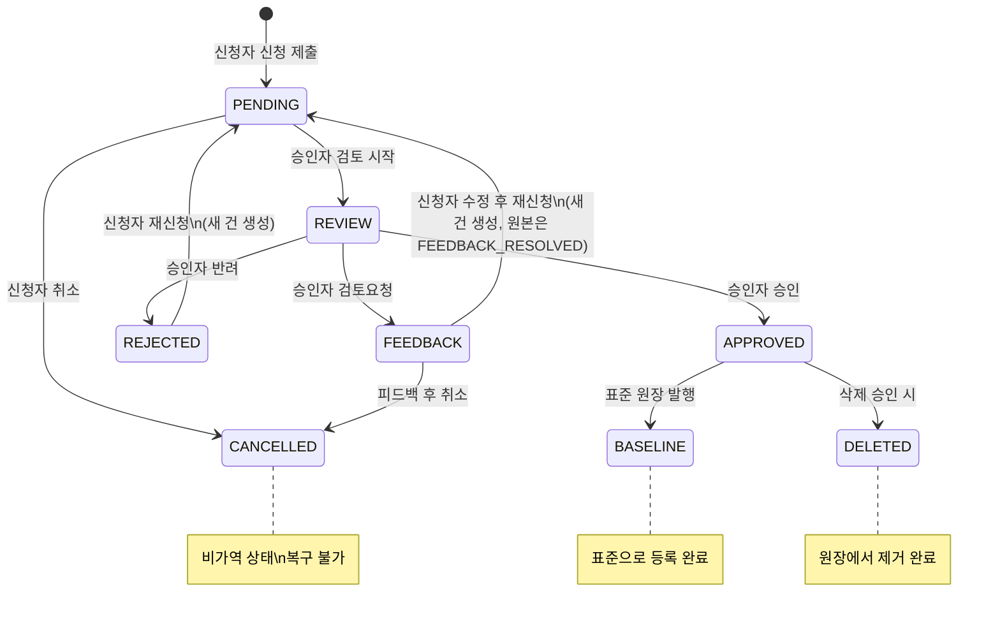
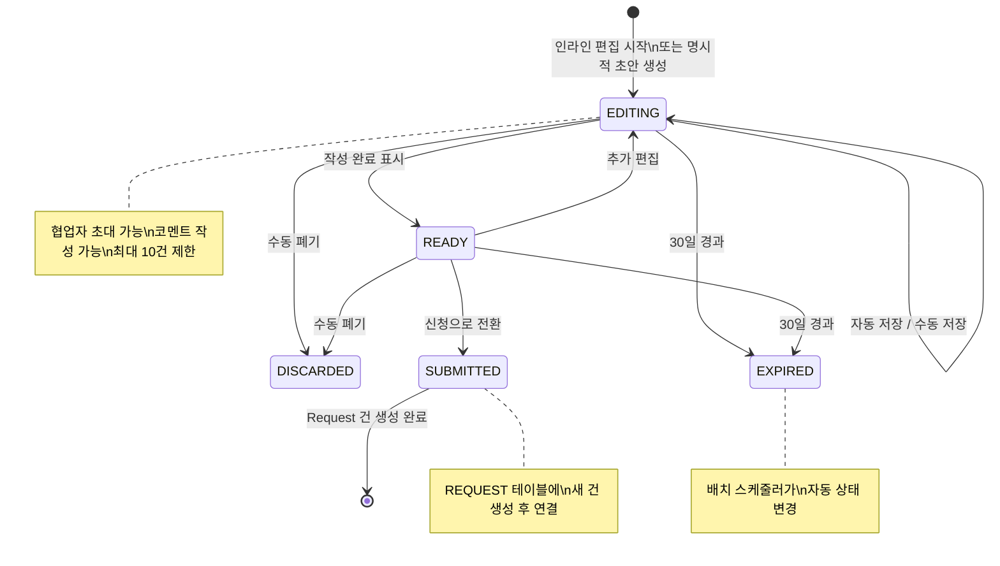
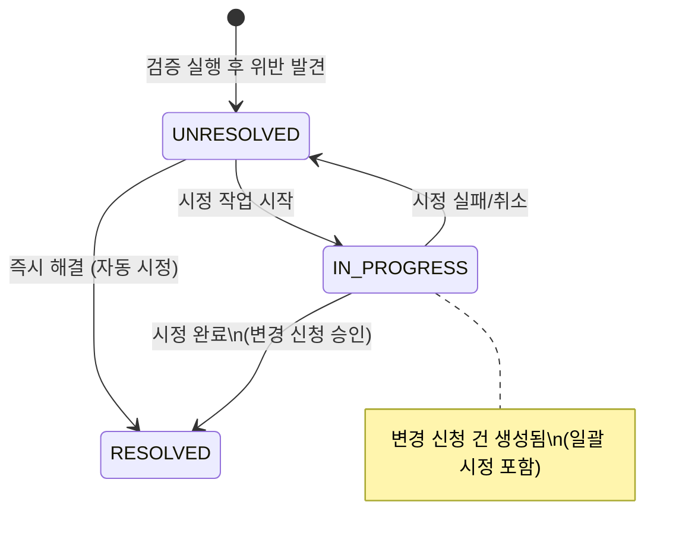

## 4. 상태 전이 다이어그램

### 4.1 신청(Request) 상태 전이



**전이 규칙:**

| 현재 상태 | 허용 전이       | 수행자 | 조건                       |
| --------- | --------------- | ------ | -------------------------- |
| PENDING   | REVIEW          | 승인자 | 신청자 본인 건 제외        |
| PENDING   | CANCELLED       | 신청자 | 본인 신청 건만             |
| REVIEW    | APPROVED        | 승인자 | 처리사유 필수              |
| REVIEW    | REJECTED        | 승인자 | 처리사유 필수              |
| REVIEW    | FEEDBACK        | 승인자 | 처리사유 필수              |
| FEEDBACK  | PENDING (새 건) | 신청자 | 수정 후 새 건 생성         |
| FEEDBACK  | CANCELLED       | 신청자 |                            |
| REJECTED  | PENDING (새 건) | 신청자 | 새 건 생성                 |
| APPROVED  | BASELINE        | 시스템 | 자동 전이 (신규/변경 승인) |
| APPROVED  | DELETED         | 시스템 | 자동 전이 (삭제 승인)      |

### 4.2 초안(Draft) 상태 전이



**전이 규칙:**

| 현재 상태 | 허용 전이 | 수행자        | 조건                           |
| --------- | --------- | ------------- | ------------------------------ |
| EDITING   | READY     | 작성자/협업자 | 필수 필드 입력 완료            |
| EDITING   | DISCARDED | 작성자        | 수동 폐기                      |
| EDITING   | EXPIRED   | 시스템        | expiresAt 경과 (배치 스케줄러) |
| READY     | EDITING   | 작성자/협업자 |                                |
| READY     | SUBMITTED | 작성자        | 신청 제출, REQUEST 생성        |
| READY     | DISCARDED | 작성자        | 수동 폐기                      |
| READY     | EXPIRED   | 시스템        | expiresAt 경과 (배치 스케줄러) |

### 4.3 검증(Validation) 상태 전이



---

## 5. API 명세

### 5.0 공통 규격

- **Base URL**: `/api`
- **인증**: 세션 기반 (로그인 후 쿠키/토큰), Authorization 헤더
- **응답 포맷**: JSON (`Content-Type: application/json`)
- **페이지네이션**: `?page=1&size=10`
- **정렬**: `?sort=fieldName&order=asc|desc`
- **에러 응답**: `{ error: { code: string, message: string, details?: object } }`

```typescript
/** 공통 페이지네이션 응답 */
interface PaginatedResponse<T> {
  items: T[];
  total: number;
  page: number;
  size: number;
  totalPages: number;
}

/** 공통 에러 응답 */
interface ErrorResponse {
  error: {
    code: string;
    message: string;
    details?: Record<string, string>;
  };
}
```

### 5.1 인증 API

| Method | Path                | 설명             | 권한      |
| ------ | ------------------- | ---------------- | --------- |
| POST   | `/api/auth/login`   | 로그인           | 공개      |
| POST   | `/api/auth/logout`  | 로그아웃         | 인증 필요 |
| GET    | `/api/auth/session` | 세션/프로필 확인 | 인증 필요 |

**POST `/api/auth/login`**

```typescript
// Request
interface LoginRequest {
  loginId: string;
  password: string;
}

// Response 200
interface LoginResponse {
  user: {
    userId: number;
    loginId: string;
    userName: string;
    role: UserRole;
    department: string | null;
  };
  token: string;
  expiresAt: string; // ISO 8601
}
```

**GET `/api/auth/session`**

```typescript
// Response 200
interface SessionResponse {
  user: {
    userId: number;
    loginId: string;
    userName: string;
    role: UserRole;
    department: string | null;
    email: string | null;
  };
  permissions: MenuPermission[];
}
```

### 5.2 대시보드 API

> Pillar 4 (역할 적응형 대시보드) -- 역할에 따라 반환 데이터가 달라진다.

| Method | Path                             | 설명           | 권한             |
| ------ | -------------------------------- | -------------- | ---------------- |
| GET    | `/api/dashboard/stats`           | 표준 건수 통계 | 모든 인증 사용자 |
| GET    | `/api/dashboard/pending`         | 승인 대기 건수 | 승인자 이상      |
| GET    | `/api/dashboard/recent-activity` | 최근 활동      | 모든 인증 사용자 |
| GET    | `/api/dashboard/trend`           | 월별 등록 추이 | 모든 인증 사용자 |
| GET    | `/api/dashboard/my-summary`      | 내 활동 요약   | 모든 인증 사용자 |
| GET    | `/api/dashboard/role-kpi`        | 역할별 KPI     | 모든 인증 사용자 |

**GET `/api/dashboard/stats`**

```typescript
// Response 200
interface DashboardStats {
  words: { total: number; monthChange: number };
  domains: { total: number; monthChange: number };
  terms: { total: number; monthChange: number };
  commonCodes: { total: number; monthChange: number };
}
```

**GET `/api/dashboard/role-kpi`**

```typescript
// Response 200 (역할별 차별화)
interface RoleKpi {
  role: UserRole;
  kpis: {
    // 승인자용
    pendingApprovals?: number;
    avgProcessingDays?: number;
    approvalRate?: number;
    // 신청자용
    myPendingCount?: number;
    myApprovedCount?: number;
    myRejectedCount?: number;
    // 공통
    complianceRate: number;
    totalViolations: number;
  };
}
```

### 5.3 통합 탐색기 API (검색/필터/페이지네이션)

> Pillar 1 (통합 표준 탐색기) -- 3개 엔티티(표준용어/도메인/단어)를 통합 검색하는 API.

| Method | Path                         | 설명            | 권한             |
| ------ | ---------------------------- | --------------- | ---------------- |
| GET    | `/api/explorer/search`       | 통합 검색       | 모든 인증 사용자 |
| GET    | `/api/explorer/facets`       | 패싯 필터 옵션  | 모든 인증 사용자 |
| GET    | `/api/explorer/autocomplete` | 검색어 자동완성 | 모든 인증 사용자 |

**GET `/api/explorer/search`**

```typescript
// Query Parameters
interface ExplorerSearchParams {
  keyword?: string; // 검색어 (이름, 약어, 정의 전문 검색)
  types?: TargetType[]; // 대상 유형 필터 (복수 선택)
  domainType?: string; // 도메인유형 필터
  status?: StandardStatus[]; // 상태 필터 (복수 선택)
  infoType?: string; // 인포타입 필터 (용어 전용)
  dateFrom?: string; // 등록일 범위 시작 (ISO 8601)
  dateTo?: string; // 등록일 범위 종료
  page?: number; // 기본값 1
  size?: number; // 기본값 10, 최대 100
  sort?: string; // 정렬 필드 (name, regDate, status)
  order?: "asc" | "desc"; // 정렬 방향 (기본값 asc)
}

// Response 200
interface ExplorerSearchResponse {
  items: ExplorerItem[];
  total: number;
  page: number;
  size: number;
  totalPages: number;
  facets: {
    types: { type: TargetType; count: number }[];
    domainTypes: { code: string; name: string; count: number }[];
    statuses: { status: StandardStatus; count: number }[];
  };
}

interface ExplorerItem {
  id: number;
  type: TargetType; // WORD | DOMAIN | TERM
  name: string; // 표준명
  abbrName?: string; // 영문약어 (단어만)
  physicalName?: string; // 물리명 (용어만)
  domainType: string; // 도메인유형
  definition: string; // 정의 (하이라이트 포함)
  status: StandardStatus;
  regDate: string;
  regUserName: string;
  highlightedFields?: Record<string, string>; // 검색어 매칭 하이라이트
}
```

**GET `/api/explorer/autocomplete`**

```typescript
// Query Parameters
interface AutocompleteParams {
  q: string; // 검색어 (최소 2자)
  types?: TargetType[];
  limit?: number; // 기본값 5, 최대 10
}

// Response 200
interface AutocompleteResponse {
  suggestions: {
    text: string;
    type: TargetType;
    id: number;
    matchField: string; // name, abbrName, physicalName
  }[];
}
```

### 5.4 표준 CRUD API

| Method | Path                                  | 설명            | 권한             |
| ------ | ------------------------------------- | --------------- | ---------------- |
| GET    | `/api/standards/words`                | 표준단어 목록   | 모든 인증 사용자 |
| GET    | `/api/standards/words/{id}`           | 표준단어 상세   | 모든 인증 사용자 |
| GET    | `/api/standards/words/{id}/terms`     | 관련 용어       | 모든 인증 사용자 |
| GET    | `/api/standards/words/{id}/history`   | 변경 이력       | 모든 인증 사용자 |
| GET    | `/api/standards/domains`              | 표준도메인 목록 | 모든 인증 사용자 |
| GET    | `/api/standards/domains/{id}`         | 표준도메인 상세 | 모든 인증 사용자 |
| GET    | `/api/standards/domains/{id}/terms`   | 관련 용어       | 모든 인증 사용자 |
| GET    | `/api/standards/domains/{id}/history` | 변경 이력       | 모든 인증 사용자 |
| GET    | `/api/standards/terms`                | 표준용어 목록   | 모든 인증 사용자 |
| GET    | `/api/standards/terms/{id}`           | 표준용어 상세   | 모든 인증 사용자 |
| GET    | `/api/standards/terms/{id}/words`     | 구성 단어       | 모든 인증 사용자 |
| GET    | `/api/standards/terms/{id}/domain`    | 사용 도메인     | 모든 인증 사용자 |
| GET    | `/api/standards/terms/{id}/history`   | 변경 이력       | 모든 인증 사용자 |

**GET `/api/standards/words`**

```typescript
// Query Parameters
interface WordListParams {
  keyword?: string;
  status?: string;
  domainType?: string;
  page?: number;
  size?: number;
  sort?: string;
  order?: "asc" | "desc";
}

// Response 200
type WordListResponse = PaginatedResponse<StandardWord>;
```

**GET `/api/standards/words/{id}`**

```typescript
// Response 200
interface WordDetailResponse extends StandardWord {
  regUserName: string;
  relatedTermCount: number;
  domainTypeName: string | null;
  statusName: string;
}
```

### 5.5 거버넌스 API (신청/승인/반려)

| Method | Path                          | 설명                | 권한             |
| ------ | ----------------------------- | ------------------- | ---------------- |
| POST   | `/api/requests/words`         | 표준단어 신청       | 신청자 이상      |
| POST   | `/api/requests/domains`       | 표준도메인 신청     | 신청자 이상      |
| POST   | `/api/requests/terms`         | 표준용어 신청       | 신청자 이상      |
| POST   | `/api/requests/common-codes`  | 공통코드 신청       | 표준 관리자 이상 |
| GET    | `/api/requests`               | 전체 신청 목록      | 신청자 이상      |
| GET    | `/api/requests/my`            | 내 신청 목록        | 신청자 이상      |
| GET    | `/api/requests/my/stats`      | 내 신청 통계        | 신청자 이상      |
| GET    | `/api/requests/{id}`          | 신청 상세           | 신청자 이상      |
| GET    | `/api/requests/{id}/feedback` | 피드백 상세         | 신청자 이상      |
| PATCH  | `/api/requests/{id}/cancel`   | 신청 취소           | 신청자 (본인 건) |
| POST   | `/api/requests/{type}/delete` | 삭제 신청 + 영향도  | 신청자 이상      |
| GET    | `/api/approvals`              | 승인 대기 목록      | 승인자 이상      |
| GET    | `/api/approvals/stats`        | 승인 통계           | 승인자 이상      |
| GET    | `/api/approvals/{id}`         | 신청 상세 (승인 뷰) | 승인자 이상      |
| GET    | `/api/approvals/{id}/changes` | 변경 전후 비교      | 승인자 이상      |
| GET    | `/api/approvals/{id}/history` | 처리 이력           | 승인자 이상      |
| POST   | `/api/approvals/{id}/process` | 승인/반려/검토요청  | 승인자 이상      |
| POST   | `/api/approvals/batch`        | 일괄 처리           | 승인자 이상      |

**POST `/api/requests/words`**

```typescript
// Request
interface CreateWordRequest {
  wordName: string;
  abbrName: string;
  engName: string;
  definition: string;
  domainType?: string;
  requestType: RequestType;
  reason?: string;
  targetId?: number; // 변경 시 기존 단어 ID
}

// Response 201
interface CreateRequestResponse {
  requestId: number;
  requestNo: string;
  status: "PENDING";
}
```

**POST `/api/approvals/{id}/process`**

```typescript
// Request
interface ProcessApprovalRequest {
  action: "approve" | "reject" | "feedback";
  reason: string; // 필수
}

// Response 200
interface ProcessApprovalResponse {
  requestId: number;
  status: RequestStatus;
  processDate: string;
}
```

**POST `/api/approvals/batch`**

```typescript
// Request
interface BatchApprovalRequest {
  ids: number[];
  action: "approve" | "reject";
  reason: string; // 필수
}

// Response 200
interface BatchApprovalResponse {
  processed: number;
  results: {
    requestId: number;
    status: RequestStatus;
    success: boolean;
    error?: string;
  }[];
}
```

### 5.6 인라인 거버넌스 API (편집 -> 자동 신청)

> Pillar 2 (인라인 거버넌스) -- 사용자가 상세 페이지에서 직접 필드를 편집하면 자동으로 Draft가 생성되고, 확인 후 Request로 전환되는 데이터 플로우.

| Method | Path                                      | 설명                               | 권한          |
| ------ | ----------------------------------------- | ---------------------------------- | ------------- |
| POST   | `/api/inline-governance/edit`             | 인라인 편집 시작 (Draft 자동 생성) | 신청자 이상   |
| PATCH  | `/api/inline-governance/{draftId}/field`  | 개별 필드 업데이트                 | 작성자/협업자 |
| POST   | `/api/inline-governance/{draftId}/submit` | 초안 -> 신청 전환                  | 작성자        |
| GET    | `/api/inline-governance/{draftId}/diff`   | 변경 사항 미리보기                 | 작성자/협업자 |

**POST `/api/inline-governance/edit`**

```typescript
// Request
interface InlineEditRequest {
  targetType: TargetType;
  targetId: number; // 편집 대상 표준 ID
}

// Response 201
interface InlineEditResponse {
  draftId: number;
  status: "EDITING";
  originalData: Record<string, unknown>; // 현재 표준 데이터
}
```

**데이터 플로우:**

```markdown
1. 사용자가 상세 페이지에서 "편집" 클릭
2. POST /api/inline-governance/edit -> Draft(EDITING) 생성
3. 사용자가 필드를 수정할 때마다:
   PATCH /api/inline-governance/{draftId}/field -> Draft.data 업데이트
   (자동 저장: 300ms 디바운스 — 타이핑 멈춤 후 자동 저장 + 필드 blur 이벤트 시 즉시 저장)
4. 사용자가 "신청" 클릭:
   POST /api/inline-governance/{draftId}/submit
   -> Draft 상태: EDITING -> SUBMITTED
   -> Request 건 자동 생성 (CREATE/UPDATE/DELETE)
   -> RequestChange 레코드 자동 생성 (변경된 필드만)
   -> AuditLog 기록
   -> Notification 생성 (승인자에게)
```

**PATCH `/api/inline-governance/{draftId}/field`**

```typescript
// Request
interface InlineFieldUpdateRequest {
  fieldName: string;
  value: unknown;
}

// Response 200
interface InlineFieldUpdateResponse {
  draftId: number;
  fieldName: string;
  autoSavedAt: string;
  version: number;
}
```

**POST `/api/inline-governance/{draftId}/submit`**

```typescript
// Request
interface InlineSubmitRequest {
  reason?: string; // 신청사유
  requestType: RequestType; // 신규/변경/삭제
}

// Response 201
interface InlineSubmitResponse {
  requestId: number;
  requestNo: string;
  draftId: number;
  changes: {
    fieldName: string;
    oldValue: unknown;
    newValue: unknown;
  }[];
}
```

### 5.7 초안 & 협업 API

> Pillar 5 (초안 & 협업) -- Draft CRUD 및 협업 기능.

| Method | Path                                      | 설명                                        | 권한          |
| ------ | ----------------------------------------- | ------------------------------------------- | ------------- |
| GET    | `/api/drafts`                             | 내 초안 목록                                | 신청자 이상   |
| POST   | `/api/drafts`                             | 초안 생성 (사용자당 최대 10건, 초과 시 422) | 신청자 이상   |
| GET    | `/api/drafts/{id}`                        | 초안 상세                                   | 작성자/협업자 |
| PUT    | `/api/drafts/{id}`                        | 초안 전체 저장                              | 작성자/협업자 |
| PATCH  | `/api/drafts/{id}/status`                 | 초안 상태 변경                              | 작성자        |
| DELETE | `/api/drafts/{id}`                        | 초안 삭제 (DISCARDED)                       | 작성자        |
| POST   | `/api/drafts/{id}/collaborators`          | 협업자 초대                                 | 작성자        |
| DELETE | `/api/drafts/{id}/collaborators/{userId}` | 협업자 제거                                 | 작성자        |
| POST   | `/api/drafts/{id}/submit`                 | 초안 -> 신청 전환                           | 작성자        |
| GET    | `/api/comments`                           | 코멘트 목록                                 | 작성자/협업자 |
| POST   | `/api/comments`                           | 코멘트 작성                                 | 신청자 이상   |
| PUT    | `/api/comments/{id}`                      | 코멘트 수정                                 | 작성자 본인   |
| DELETE | `/api/comments/{id}`                      | 코멘트 삭제                                 | 작성자 본인   |
| PATCH  | `/api/comments/{id}/resolve`              | 코멘트 해결 처리                            | 작성자/협업자 |

**POST `/api/drafts`**

```typescript
// Request
interface CreateDraftRequest {
  targetType: TargetType;
  targetId?: number; // 기존 표준 기반 시
  title: string;
  data: Record<string, unknown>;
}

// Response 201
interface CreateDraftResponse {
  draftId: number;
  status: "EDITING";
  version: 1;
}
```

**POST `/api/comments`**

```typescript
// Request
interface CreateCommentRequest {
  targetType: CommentTarget; // DRAFT | REQUEST
  targetId: number;
  content: string;
  fieldName?: string; // 인라인 코멘트 시
  parentCommentId?: number; // 답글 시
}

// Response 201
interface CreateCommentResponse {
  commentId: number;
  createdAt: string;
}
```

### 5.8 검증 API

| Method | Path                                        | 설명                    | 권한               |
| ------ | ------------------------------------------- | ----------------------- | ------------------ |
| GET    | `/api/validations/summary`                  | 위반 통계 (유형별 건수) | 모든 인증 사용자   |
| GET    | `/api/validations/trend`                    | 월별 위반 추이          | 모든 인증 사용자   |
| GET    | `/api/validations/rules`                    | 규칙별 위반 현황        | 모든 인증 사용자   |
| GET    | `/api/validations/history`                  | 검증 실행 이력          | 모든 인증 사용자   |
| POST   | `/api/validations/execute`                  | 검증 실행               | 관리자/표준 관리자 |
| GET    | `/api/validations/violations`               | 위반 항목 목록          | 모든 인증 사용자   |
| POST   | `/api/validations/violations/batch-correct` | 일괄 시정 신청          | 신청자 이상        |

**POST `/api/validations/execute`**

```typescript
// Request
interface ExecuteValidationRequest {
  targetScope?: string; // "ALL" | "WORD" | "DOMAIN" | "TERM" (기본값 ALL)
  ruleTypes?: ValidationRuleType[]; // 특정 규칙만 실행 (생략 시 전체)
}

// Response 202 (비동기 처리)
interface ExecuteValidationResponse {
  executionId: number;
  status: "RUNNING";
  estimatedDuration: number; // 예상 소요 시간 (초)
}
```

**GET `/api/validations/violations`**

```typescript
// Query Parameters
interface ViolationListParams {
  ruleType?: ValidationRuleType;
  targetType?: TargetType;
  severity?: Severity;
  resolveStatus?: ResolveStatus;
  keyword?: string;
  page?: number;
  size?: number;
}

// Response 200
type ViolationListResponse = PaginatedResponse<ValidationResult>;
```

### 5.9 AI Data Butler API

> Pillar 3 (AI Data Butler 2.0) -- AI 기반 추천, 자동완성, 유사어 검색, 품질 점수 평가.

| Method | Path                                | 설명                          | 권한             |
| ------ | ----------------------------------- | ----------------------------- | ---------------- |
| GET    | `/api/ai/suggest`                   | AI 유사 표준 추천             | 모든 인증 사용자 |
| GET    | `/api/ai/suggest/{id}/match-detail` | 매칭 근거 상세                | 모든 인증 사용자 |
| POST   | `/api/ai/autocomplete`              | AI 자동완성 (정의, 영문명 등) | 신청자 이상      |
| POST   | `/api/ai/quality-score`             | 품질 점수 평가                | 모든 인증 사용자 |
| GET    | `/api/ai/synonyms`                  | 유사어/동의어 검색            | 모든 인증 사용자 |
| POST   | `/api/ai/generate-physical-name`    | 물리명 자동 생성              | 신청자 이상      |
| POST   | `/api/ai/validate-naming`           | 명명 규칙 실시간 검증         | 신청자 이상      |

**GET `/api/ai/suggest`**

```typescript
// Query Parameters
interface AiSuggestParams {
  keyword: string; // 검색어
  type: "word" | "domain" | "term"; // 대상 유형
  limit?: number; // 결과 수 (기본값 3, 최대 10)
  threshold?: number; // 최소 유사도 (기본값 50)
}

// Response 200
interface AiSuggestResponse {
  results: {
    id: number;
    name: string;
    abbrName?: string;
    type: TargetType;
    status: StandardStatus;
    similarity: number; // 0-100 종합 유사도
    matchReasons: {
      syllable: number; // 음절 유사도
      semantic: number; // 의미 유사도
      pattern: number; // 약어 패턴 유사도
    };
    isDuplicate: boolean; // 80% 이상 시 중복 경고
  }[];
  duplicateWarning: boolean; // 80%+ 유사 항목 존재 여부
}
```

**POST `/api/ai/autocomplete`**

```typescript
// Request
interface AiAutocompleteRequest {
  field: "definition" | "engName" | "abbrName"; // 자동완성 대상 필드
  context: {
    wordName?: string;
    termName?: string;
    domainType?: string;
    existingWords?: string[]; // 이미 입력된 구성 단어
  };
  partialInput?: string; // 현재 입력 중인 텍스트
}

// Response 200
interface AiAutocompleteResponse {
  suggestions: {
    text: string;
    confidence: number; // 0-100
    source: "pattern" | "semantic" | "historical"; // 추천 근거
  }[];
}
```

**POST `/api/ai/quality-score`**

```typescript
// Request
interface QualityScoreRequest {
  targetType: TargetType;
  data: Record<string, unknown>; // 평가 대상 데이터
}

// Response 200
interface QualityScoreResponse {
  overallScore: number; // 0-100 종합 점수
  breakdown: {
    naming: number; // 명명 규칙 준수
    completeness: number; // 필드 완성도
    consistency: number; // 기존 표준과의 일관성
    uniqueness: number; // 고유성 (중복 없음)
  };
  recommendations: string[]; // 개선 권고 사항
}
```

**POST `/api/ai/generate-physical-name`**

```typescript
// Request
interface GeneratePhysicalNameRequest {
  termName: string;
  wordIds: number[]; // 구성 단어 ID 배열
  infoType: string; // 인포타입
}

// Response 200
interface GeneratePhysicalNameResponse {
  physicalName: string; // 자동 생성된 물리명
  components: {
    wordName: string;
    abbrName: string;
    seq: number;
  }[];
}
```

### 5.10 공통코드 API

| Method | Path                                  | 설명               | 권한               |
| ------ | ------------------------------------- | ------------------ | ------------------ |
| GET    | `/api/common-codes/groups`            | 코드그룹 목록      | 모든 인증 사용자   |
| GET    | `/api/common-codes/groups/{id}`       | 코드그룹 상세      | 모든 인증 사용자   |
| GET    | `/api/common-codes/groups/{id}/codes` | 그룹 내 코드 목록  | 모든 인증 사용자   |
| POST   | `/api/common-codes/groups`            | 코드그룹 생성      | 관리자/표준 관리자 |
| PUT    | `/api/common-codes/groups/{id}`       | 코드그룹 수정      | 관리자/표준 관리자 |
| POST   | `/api/common-codes/groups/{id}/codes` | 코드 추가          | 관리자/표준 관리자 |
| PUT    | `/api/common-codes/codes/{id}`        | 코드 수정          | 관리자/표준 관리자 |
| DELETE | `/api/common-codes/codes/{id}`        | 코드 삭제          | 관리자/표준 관리자 |
| DELETE | `/api/common-codes/groups/{id}`       | 코드그룹 삭제      | 관리자/표준 관리자 |
| GET    | `/api/common-codes/search`            | 공통코드 통합 검색 | 모든 인증 사용자   |

### 5.11 시스템 관리 API

#### 사용자 관리

| Method | Path              | 설명        | 권한         |
| ------ | ----------------- | ----------- | ------------ |
| GET    | `/api/users`      | 사용자 목록 | 시스템관리자 |
| POST   | `/api/users`      | 사용자 생성 | 시스템관리자 |
| PUT    | `/api/users/{id}` | 사용자 수정 | 시스템관리자 |
| DELETE | `/api/users/{id}` | 사용자 삭제 | 시스템관리자 |

#### 권한 관리

| Method | Path                      | 설명                  | 권한         |
| ------ | ------------------------- | --------------------- | ------------ |
| GET    | `/api/permissions/{role}` | 역할별 메뉴 권한 조회 | 시스템관리자 |
| PUT    | `/api/permissions/{role}` | 역할별 메뉴 권한 저장 | 시스템관리자 |

#### 시스템 코드

| Method | Path                     | 설명                 | 권한         |
| ------ | ------------------------ | -------------------- | ------------ |
| GET    | `/api/system-codes`      | 시스템 코드 조회     | 시스템관리자 |
| POST   | `/api/system-codes`      | 코드 추가 (비보호만) | 시스템관리자 |
| PUT    | `/api/system-codes/{id}` | 코드 수정 (비보호만) | 시스템관리자 |
| DELETE | `/api/system-codes/{id}` | 코드 삭제 (비보호만) | 시스템관리자 |

#### DB 설정

| Method | Path                     | 설명                  | 권한         |
| ------ | ------------------------ | --------------------- | ------------ |
| GET    | `/api/settings/db`       | DB 접속 정보 조회     | 시스템관리자 |
| PUT    | `/api/settings/db`       | DB 접속 정보 저장     | 시스템관리자 |
| POST   | `/api/settings/db/test`  | 접속 테스트           | 시스템관리자 |
| GET    | `/api/settings/ssh`      | SSH 설정 조회         | 시스템관리자 |
| PUT    | `/api/settings/ssh`      | SSH 설정 저장         | 시스템관리자 |
| POST   | `/api/settings/ssh/test` | SSH 터널링 테스트     | 시스템관리자 |
| GET    | `/api/settings/export`   | 접속정보 XML 내보내기 | 시스템관리자 |
| POST   | `/api/settings/import`   | 접속정보 XML 가져오기 | 시스템관리자 |

### 5.12 알림 API

> Pillar 6 (시스템 전역 UX) -- 실시간 알림 및 알림 관리.

| Method | Path                              | 설명                 | 권한             |
| ------ | --------------------------------- | -------------------- | ---------------- |
| GET    | `/api/notifications`              | 내 알림 목록         | 모든 인증 사용자 |
| GET    | `/api/notifications/unread-count` | 읽지 않은 알림 수    | 모든 인증 사용자 |
| PATCH  | `/api/notifications/{id}/read`    | 알림 읽음 처리       | 본인             |
| PATCH  | `/api/notifications/read-all`     | 전체 읽음 처리       | 본인             |
| DELETE | `/api/notifications/{id}`         | 알림 삭제            | 본인             |
| GET    | `/api/notifications/subscribe`    | SSE 실시간 알림 구독 | 모든 인증 사용자 |

**GET `/api/notifications`**

```typescript
// Query Parameters
interface NotificationListParams {
  type?: NotificationType;
  isRead?: boolean;
  page?: number;
  size?: number;
}

// Response 200
type NotificationListResponse = PaginatedResponse<Notification>;
```

**GET `/api/notifications/subscribe`** (Server-Sent Events)

```typescript
// SSE Event Stream
// Content-Type: text/event-stream

// Event format:
// event: notification
// data: { "notificationId": 123, "type": "APPROVAL_REQUIRED", "title": "...", "message": "..." }

// event: heartbeat
// data: { "timestamp": "2026-03-20T10:00:00Z" }
```

**알림 자동 생성 규칙:**

| 이벤트      | 알림 유형              | 수신자                         | 우선순위 |
| ----------- | ---------------------- | ------------------------------ | -------- |
| 신청 생성   | APPROVAL_REQUIRED      | 승인자 역할 전체 (신청자 제외) | HIGH     |
| 신청 승인   | REQUEST_STATUS_CHANGED | 신청자                         | NORMAL   |
| 신청 반려   | REQUEST_STATUS_CHANGED | 신청자                         | HIGH     |
| 피드백 요청 | FEEDBACK_RECEIVED      | 신청자                         | HIGH     |
| 코멘트 추가 | COMMENT_ADDED          | 초안/신청 관련자               | NORMAL   |
| 초안 공유   | DRAFT_SHARED           | 초대된 협업자                  | NORMAL   |
| 검증 완료   | VALIDATION_COMPLETED   | 관리자/표준 관리자             | NORMAL   |

### 5.13 감사 추적 API

| Method | Path                                      | 설명                      | 권한        |
| ------ | ----------------------------------------- | ------------------------- | ----------- |
| GET    | `/api/audit`                              | 감사 이력 조회            | 신청자 이상 |
| GET    | `/api/audit/item/{targetType}/{targetId}` | 항목별 전체 이력 타임라인 | 신청자 이상 |

**GET `/api/audit`**

```typescript
// Query Parameters
interface AuditListParams {
  targetType?: TargetType;
  keyword?: string;
  from?: string; // ISO 8601
  to?: string; // ISO 8601
  actionType?: ActionType;
  actor?: string; // 사용자 이름 또는 ID
  page?: number;
  size?: number;
}

// Response 200
type AuditListResponse = PaginatedResponse<AuditLog>;
```

**GET `/api/audit/item/{targetType}/{targetId}`**

```typescript
// Response 200
interface AuditTimelineResponse {
  targetType: TargetType;
  targetId: number;
  targetName: string;
  timeline: {
    logId: number;
    logDatetime: string;
    actionType: ActionType;
    stateFrom: string | null;
    stateTo: string | null;
    actorName: string;
    actorRole: string | null;
    comment: string | null;
    requestNo: string | null;
  }[];
}
```

### 5.14 거버넌스 포털 API

| Method | Path                                 | 설명                 | 권한                                                                                                                       |
| ------ | ------------------------------------ | -------------------- | -------------------------------------------------------------------------------------------------------------------------- |
| GET    | `/api/governance/compliance`         | 유형별 준수율 게이지 | 거버넌스 권한 (관리자/승인자/표준 관리자). 단, 신청자 대시보드 미니 게이지용으로 `/api/dashboard/stats`에 요약 준수율 포함 |
| GET    | `/api/governance/kpi`                | KPI 지표             | 거버넌스 권한 (관리자/승인자/표준 관리자)                                                                                  |
| GET    | `/api/governance/trend`              | 월별 표준화율 추이   | 거버넌스 권한 (관리자/승인자/표준 관리자)                                                                                  |
| GET    | `/api/governance/department-ranking` | 부서별 준수율 랭킹   | 거버넌스 권한 (관리자/승인자/표준 관리자)                                                                                  |
| GET    | `/api/governance/non-compliant`      | 미준수 항목 Top N    | 거버넌스 권한 (관리자/승인자/표준 관리자)                                                                                  |
| GET    | `/api/governance/report/pdf`         | PDF 리포트 생성      | 거버넌스 권한 (관리자/승인자/표준 관리자)                                                                                  |

**GET `/api/governance/compliance`**

```typescript
// Response 200
interface ComplianceResponse {
  overall: number; // 전체 준수율 (%)
  byType: {
    type: TargetType;
    rate: number; // 준수율 (%)
    total: number; // 전체 건수
    compliant: number; // 준수 건수
    nonCompliant: number; // 미준수 건수
  }[];
}
```

**GET `/api/governance/kpi`**

```typescript
// Response 200
interface GovernanceKpi {
  processingRate: number; // 처리율 (%)
  avgApprovalDays: number; // 평균 승인 소요일
  rejectionRate: number; // 반려율 (%)
  violationCount: number; // 총 위반 건수
  monthOverMonth: {
    processingRate: number; // 전월 대비 변화
    avgApprovalDays: number;
    rejectionRate: number;
    violationCount: number;
  };
}
```

### 5.15 API 엔드포인트 총괄

| 카테고리             | 엔드포인트 수 | Pillar   |
| -------------------- | :-----------: | -------- |
| 인증                 |       3       | -        |
| 대시보드             |       6       | Pillar 4 |
| 통합 탐색기          |       3       | Pillar 1 |
| 표준 CRUD (단어)     |       4       | -        |
| 표준 CRUD (도메인)   |       4       | -        |
| 표준 CRUD (용어)     |       5       | -        |
| 거버넌스 (신청/승인) |      18       | -        |
| 인라인 거버넌스      |       4       | Pillar 2 |
| 초안 & 협업          |      15       | Pillar 5 |
| 검증                 |       7       | -        |
| AI Data Butler       |       7       | Pillar 3 |
| 공통코드             |      10       | -        |
| 사용자 관리          |       4       | -        |
| 권한 관리            |       2       | -        |
| 시스템 코드          |       4       | -        |
| DB 설정              |       8       | -        |
| 알림                 |       6       | Pillar 6 |
| 감사 추적            |       2       | -        |
| 거버넌스 포털        |       6       | Pillar 4 |
| **합계**             |    **118**    |          |
