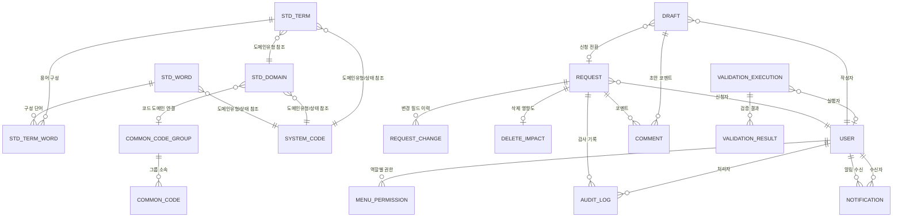
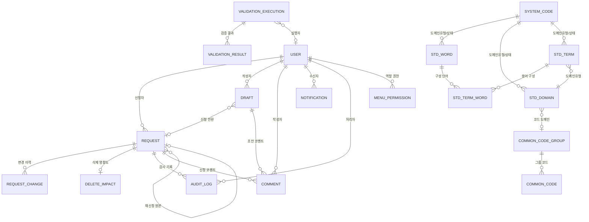

## 1. 데이터 모델 개요

### 1.1 엔티티 총괄

| #   | 엔티티         | 테이블명             | 구분        | 비고            |
| --- | -------------- | -------------------- | ----------- | --------------- |
| 1   | 표준단어       | STD_WORD             | 핵심 도메인 | 기존            |
| 2   | 표준도메인     | STD_DOMAIN           | 핵심 도메인 | 기존            |
| 3   | 표준용어       | STD_TERM             | 핵심 도메인 | 기존            |
| 4   | 용어-단어 관계 | STD_TERM_WORD        | 핵심 도메인 | 기존            |
| 5   | 공통코드그룹   | COMMON_CODE_GROUP    | 공통코드    | 기존            |
| 6   | 공통코드       | COMMON_CODE          | 공통코드    | 기존            |
| 7   | 신청           | REQUEST              | 거버넌스    | 기존            |
| 8   | 신청변경이력   | REQUEST_CHANGE       | 거버넌스    | 기존            |
| 9   | 삭제영향도     | DELETE_IMPACT        | 거버넌스    | 기존            |
| 10  | 초안           | DRAFT                | 거버넌스    | **신규**        |
| 11  | 코멘트         | COMMENT              | 거버넌스    | **신규**        |
| 12  | 검증실행       | VALIDATION_EXECUTION | 검증        | 기존            |
| 13  | 검증결과       | VALIDATION_RESULT    | 검증        | 기존            |
| 14  | 사용자         | USER                 | 시스템      | 기존            |
| 15  | 메뉴권한       | MENU_PERMISSION      | 시스템      | 기존            |
| 16  | 시스템코드     | SYSTEM_CODE          | 시스템      | 기존            |
| 17  | 알림           | NOTIFICATION         | 시스템      | **신규**        |
| 18  | 감사이력       | AUDIT_LOG            | 시스템      | 기존            |
| 19  | DB연결         | DATABASE_CONNECTION  | 시스템      | 기존(명세 확장) |

### 1.2 ER 다이어그램



---

## 2. 엔티티 상세

> 모든 엔티티에는 공통 감사 필드가 포함된다. 아래 `BaseEntity`를 상속한다.

```typescript
/** 모든 엔티티의 공통 감사 필드 */
interface BaseEntity {
  createdAt: Date; // 생성일시
  createdBy: string; // 생성자 ID
  updatedAt: Date; // 수정일시
  updatedBy: string; // 수정자 ID
}
```

### 2.1 핵심 도메인 엔티티

#### StandardWord (표준단어)

> 조직 내 데이터 명칭의 최소 단위. 표준용어를 구성하는 기본 빌딩 블록.

```typescript
interface StandardWord extends BaseEntity {
  wordId: number; // PK, 자동 생성
  wordName: string; // 표준단어명 (한국어), max 100
  abbrName: string; // 영문약어 (대문자), max 50
  engName: string; // 영문명, max 200
  definition: string; // 정의 (TEXT)
  domainType: string | null; // 도메인유형 코드 (FK -> SYSTEM_CODE)
  status: StandardStatus; // 상태 코드
  regDate: Date; // 등록일
  modDate: Date | null; // 최종수정일
  regUserId: number; // 등록자 (FK -> USER)
}
```

| 필드       | DB 컬럼     | 타입         | 필수 | 제약조건                                   |
| ---------- | ----------- | ------------ | ---- | ------------------------------------------ |
| wordId     | WORD_ID     | BIGINT       | Y    | PK, AUTO_INCREMENT                         |
| wordName   | WORD_NAME   | VARCHAR(100) | Y    | UNIQUE(wordName)                           |
| abbrName   | ABBR_NAME   | VARCHAR(50)  | Y    | 대문자\_언더스코어만 허용, UNIQUE          |
| engName    | ENG_NAME    | VARCHAR(200) | Y    |                                            |
| definition | DEFINITION  | TEXT         | Y    |                                            |
| domainType | DOMAIN_TYPE | VARCHAR(20)  | N    | FK -> SYSTEM_CODE(CATEGORY='도메인유형')   |
| status     | STATUS      | VARCHAR(20)  | Y    | FK -> SYSTEM_CODE(CATEGORY='표준상태코드') |
| regDate    | REG_DATE    | DATE         | Y    | DEFAULT CURRENT_DATE                       |
| modDate    | MOD_DATE    | DATE         | N    | 변경 시 자동 갱신                          |
| regUserId  | REG_USER_ID | BIGINT       | Y    | FK -> USER(USER_ID)                        |

#### StandardDomain (표준도메인)

> 데이터 타입과 길이를 정의하는 단위. 표준용어에 데이터 규격을 부여한다.

```typescript
interface StandardDomain extends BaseEntity {
  domainId: number; // PK, 자동 생성
  domainName: string; // 도메인명, max 100
  domainType: string; // 도메인유형 (FK -> SYSTEM_CODE)
  dataType: DataType; // 데이터타입 (VARCHAR, CHAR, NUMBER, DATE, CLOB, BLOB)
  dataLength: string | null; // 데이터길이 (예: "100" 또는 "15,2")
  definition: string; // 정의 (TEXT)
  status: StandardStatus; // 상태 코드
  regDate: Date; // 등록일
  modDate: Date | null; // 최종수정일
  regUserId: number; // 등록자 (FK -> USER)
}

type DataType = "VARCHAR" | "CHAR" | "NUMBER" | "DATE" | "CLOB" | "BLOB";
```

| 필드       | DB 컬럼     | 타입         | 필수 | 제약조건                                             |
| ---------- | ----------- | ------------ | ---- | ---------------------------------------------------- |
| domainId   | DOMAIN_ID   | BIGINT       | Y    | PK, AUTO_INCREMENT                                   |
| domainName | DOMAIN_NAME | VARCHAR(100) | Y    | UNIQUE(domainName)                                   |
| domainType | DOMAIN_TYPE | VARCHAR(20)  | Y    | FK -> SYSTEM_CODE(CATEGORY='도메인유형')             |
| dataType   | DATA_TYPE   | VARCHAR(20)  | Y    | ENUM('VARCHAR','CHAR','NUMBER','DATE','CLOB','BLOB') |
| dataLength | DATA_LENGTH | VARCHAR(20)  | N    | 형식: 정수 또는 "정수,정수"                          |
| definition | DEFINITION  | TEXT         | Y    |                                                      |
| status     | STATUS      | VARCHAR(20)  | Y    | FK -> SYSTEM_CODE(CATEGORY='표준상태코드')           |
| regDate    | REG_DATE    | DATE         | Y    | DEFAULT CURRENT_DATE                                 |
| modDate    | MOD_DATE    | DATE         | N    |                                                      |
| regUserId  | REG_USER_ID | BIGINT       | Y    | FK -> USER(USER_ID)                                  |

#### StandardTerm (표준용어)

> 표준단어 + 표준도메인으로 구성된 비즈니스 용어. 물리명은 구성 단어 약어 조합으로 자동 생성.

```typescript
interface StandardTerm extends BaseEntity {
  termId: number; // PK, 자동 생성
  termName: string; // 표준용어명 (한국어), max 200
  physicalName: string; // 물리명 (영문, 자동 생성), max 200
  domainType: string; // 도메인유형 (FK -> SYSTEM_CODE)
  infoType: string; // 인포타입 (사용자명, 금액, 일자, 코드, 설명, 여부)
  definition: string; // 정의 (TEXT)
  status: StandardStatus; // 상태 코드
  regDate: Date; // 등록일
  modDate: Date | null; // 최종수정일
  regUserId: number; // 등록자 (FK -> USER)
}

type StandardStatus =
  | "UNREGISTERED" // 미등록
  | "PENDING" // 신청
  | "REVIEW" // 검토
  | "APPROVED" // 승인
  | "REJECTED" // 반려
  | "FEEDBACK" // 피드백대기
  | "CANCELLED" // 취소
  | "BASELINE" // 기존 (발행됨)
  | "DELETED"; // 삭제
```

| 필드         | DB 컬럼       | 타입         | 필수 | 제약조건                     |
| ------------ | ------------- | ------------ | ---- | ---------------------------- |
| termId       | TERM_ID       | BIGINT       | Y    | PK, AUTO_INCREMENT           |
| termName     | TERM_NAME     | VARCHAR(200) | Y    |                              |
| physicalName | PHYSICAL_NAME | VARCHAR(200) | Y    | 자동 생성 (readonly), UNIQUE |
| domainType   | DOMAIN_TYPE   | VARCHAR(20)  | Y    | FK -> SYSTEM_CODE            |
| infoType     | INFO_TYPE     | VARCHAR(50)  | Y    |                              |
| definition   | DEFINITION    | TEXT         | Y    |                              |
| status       | STATUS        | VARCHAR(20)  | Y    | FK -> SYSTEM_CODE            |
| regDate      | REG_DATE      | DATE         | Y    |                              |
| modDate      | MOD_DATE      | DATE         | N    |                              |
| regUserId    | REG_USER_ID   | BIGINT       | Y    | FK -> USER(USER_ID)          |

#### StandardTermWord (용어-단어 관계)

> 표준용어를 구성하는 표준단어의 순서 정보를 관리하는 관계 테이블.

```typescript
interface StandardTermWord {
  termId: number; // FK -> STD_TERM, 복합 PK
  wordId: number; // FK -> STD_WORD, 복합 PK
  seq: number; // 단어 순서
}
```

| 필드   | DB 컬럼 | 타입   | 필수 | 제약조건              |
| ------ | ------- | ------ | ---- | --------------------- |
| termId | TERM_ID | BIGINT | Y    | PK(1), FK -> STD_TERM |
| wordId | WORD_ID | BIGINT | Y    | PK(2), FK -> STD_WORD |
| seq    | SEQ     | INT    | Y    | >= 1                  |

### 2.2 거버넌스 엔티티

#### Request (신청)

> 모든 표준 변경(신규/변경/삭제)에 대한 거버넌스 파이프라인 진입점.

```typescript
interface Request extends BaseEntity {
  requestId: number; // PK, 자동 생성
  requestNo: string; // 신청번호 (표시용, REQ-yyyy-NNNN 형식)
  targetType: TargetType; // 대상 유형
  targetId: number | null; // 대상 엔티티 FK (변경/삭제 시)
  targetName: string; // 항목명
  requestType: RequestType; // 요청구분
  status: RequestStatus; // 상태
  requesterId: number; // 신청자 (FK -> USER)
  requestDate: Date; // 신청일
  processDate: Date | null; // 처리일
  requestReason: string | null; // 신청사유
  parentRequestId: number | null; // 원본 신청 ID (재신청 시)
}

type TargetType = "WORD" | "DOMAIN" | "TERM" | "COMMON_CODE";
type RequestType = "CREATE" | "UPDATE" | "DELETE";
type RequestStatus =
  | "PENDING" // 신청
  | "REVIEW" // 검토
  | "APPROVED" // 승인
  | "REJECTED" // 반려
  | "FEEDBACK" // 피드백대기
  | "CANCELLED" // 취소
  | "FEEDBACK_RESOLVED"; // 피드백반영
```

| 필드            | DB 컬럼           | 타입         | 필수 | 제약조건                                   |
| --------------- | ----------------- | ------------ | ---- | ------------------------------------------ |
| requestId       | REQUEST_ID        | BIGINT       | Y    | PK, AUTO_INCREMENT                         |
| requestNo       | REQUEST_NO        | VARCHAR(20)  | Y    | UNIQUE, 형식: REQ-yyyy-NNNN                |
| targetType      | TARGET_TYPE       | VARCHAR(20)  | Y    | ENUM('WORD','DOMAIN','TERM','COMMON_CODE') |
| targetId        | TARGET_ID         | BIGINT       | N    | 다형성 FK (신규 시 NULL)                   |
| targetName      | TARGET_NAME       | VARCHAR(200) | Y    |                                            |
| requestType     | REQUEST_TYPE      | VARCHAR(20)  | Y    | ENUM('CREATE','UPDATE','DELETE')           |
| status          | STATUS            | VARCHAR(20)  | Y    | 기본값 'PENDING'                           |
| requesterId     | REQUESTER_ID      | BIGINT       | Y    | FK -> USER(USER_ID)                        |
| requestDate     | REQUEST_DATE      | DATE         | Y    | DEFAULT CURRENT_DATE                       |
| processDate     | PROCESS_DATE      | DATE         | N    | 최종 처리 시 갱신                          |
| requestReason   | REQUEST_REASON    | TEXT         | N    |                                            |
| parentRequestId | PARENT_REQUEST_ID | BIGINT       | N    | FK -> REQUEST(REQUEST_ID)                  |

#### RequestChange (신청변경이력)

> 변경 신청 시 필드별 현재값/변경요청값을 기록하여 승인자에게 비교 뷰를 제공한다.

```typescript
interface RequestChange extends BaseEntity {
  changeId: number; // PK, 자동 생성
  requestId: number; // FK -> REQUEST
  fieldName: string; // 변경 필드명 (단어명, 영문약어, 영문명, 정의 등)
  oldValue: string | null; // 현재값
  newValue: string | null; // 변경요청값
}
```

| 필드      | DB 컬럼    | 타입        | 필수 | 제약조건                                     |
| --------- | ---------- | ----------- | ---- | -------------------------------------------- |
| changeId  | CHANGE_ID  | BIGINT      | Y    | PK, AUTO_INCREMENT                           |
| requestId | REQUEST_ID | BIGINT      | Y    | FK -> REQUEST(REQUEST_ID), ON DELETE CASCADE |
| fieldName | FIELD_NAME | VARCHAR(50) | Y    |                                              |
| oldValue  | OLD_VALUE  | TEXT        | N    |                                              |
| newValue  | NEW_VALUE  | TEXT        | N    |                                              |

#### DeleteImpact (삭제영향도)

> 삭제 신청 시 필수로 작성하는 영향도 평가서. 승인자의 판단 근거를 제공한다.

```typescript
interface DeleteImpact extends BaseEntity {
  impactId: number; // PK, 자동 생성
  requestId: number; // FK -> REQUEST (1:1)
  targetType: TargetType; // 대상 표준 유형
  targetId: number; // 대상 표준 FK
  affectedSystems: string | null; // 영향 시스템 (콤마 구분)
  affectedOther: string | null; // 기타 영향 영역
  impactLevel: ImpactLevel; // 영향도 수준
  impactDesc: string; // 영향도 설명
  altStandard: string | null; // 대체 표준 제안
  migrationPlan: string | null; // 마이그레이션 계획
  deleteReason: string; // 삭제 사유
}

type ImpactLevel = "HIGH" | "MEDIUM" | "LOW";
```

| 필드            | DB 컬럼          | 타입         | 필수 | 제약조건                                                   |
| --------------- | ---------------- | ------------ | ---- | ---------------------------------------------------------- |
| impactId        | IMPACT_ID        | BIGINT       | Y    | PK, AUTO_INCREMENT                                         |
| requestId       | REQUEST_ID       | BIGINT       | Y    | FK -> REQUEST, UNIQUE (1:1)                                |
| targetType      | TARGET_TYPE      | VARCHAR(20)  | Y    |                                                            |
| targetId        | TARGET_ID        | BIGINT       | Y    | 다형성 FK                                                  |
| affectedSystems | AFFECTED_SYSTEMS | VARCHAR(500) | N    | 값: 운영DB,DW,보고서/대시보드,API/인터페이스,외부연동,기타 |
| affectedOther   | AFFECTED_OTHER   | TEXT         | N    |                                                            |
| impactLevel     | IMPACT_LEVEL     | VARCHAR(10)  | Y    | ENUM('HIGH','MEDIUM','LOW')                                |
| impactDesc      | IMPACT_DESC      | TEXT         | Y    |                                                            |
| altStandard     | ALT_STANDARD     | VARCHAR(200) | N    |                                                            |
| migrationPlan   | MIGRATION_PLAN   | TEXT         | N    |                                                            |
| deleteReason    | DELETE_REASON    | TEXT         | Y    |                                                            |

#### Draft (초안) -- 신규

> 인라인 거버넌스와 초안/협업을 지원하는 핵심 엔티티. 사용자가 표준을 편집하면 자동으로 초안이 생성되고, 초안 완성 후 신청(Request)으로 전환된다.

```typescript
interface Draft extends BaseEntity {
  draftId: number; // PK, 자동 생성
  targetType: TargetType; // 대상 유형
  targetId: number | null; // 기존 표준 참조 (신규 시 NULL)
  title: string; // 초안 제목
  status: DraftStatus; // 초안 상태
  authorId: number; // 작성자 (FK -> USER)
  data: Record<string, unknown>; // 초안 데이터 (JSON)
  changesSummary: string | null; // 변경 요약 (자동 생성)
  requestId: number | null; // 신청 전환 시 연결 (FK -> REQUEST)
  collaboratorIds: number[]; // 협업자 목록 (JSON 배열)
  lastEditedAt: Date; // 최종 편집 일시
  autoSavedAt: Date | null; // 자동 저장 일시
  version: number; // 초안 버전 (낙관적 잠금)
}

type DraftStatus =
  | "EDITING" // 편집 중
  | "READY" // 신청 준비 완료
  | "SUBMITTED" // 신청으로 전환됨
  | "DISCARDED" // 사용자 수동 폐기
  | "EXPIRED"; // 30일 경과 자동 만료
```

| 필드            | DB 컬럼          | 타입         | 필수 | 제약조건                                   |
| --------------- | ---------------- | ------------ | ---- | ------------------------------------------ |
| draftId         | DRAFT_ID         | BIGINT       | Y    | PK, AUTO_INCREMENT                         |
| targetType      | TARGET_TYPE      | VARCHAR(20)  | Y    | ENUM('WORD','DOMAIN','TERM','COMMON_CODE') |
| targetId        | TARGET_ID        | BIGINT       | N    | 다형성 FK (신규 시 NULL)                   |
| title           | TITLE            | VARCHAR(200) | Y    |                                            |
| status          | STATUS           | VARCHAR(20)  | Y    | 기본값 'EDITING'                           |
| authorId        | AUTHOR_ID        | BIGINT       | Y    | FK -> USER(USER_ID)                        |
| data            | DATA             | JSON         | Y    | 초안 필드 데이터 (스키마 유연)             |
| expiresAt       | EXPIRES_AT       | TIMESTAMP    | Y    | 생성 후 30일, 초과 시 자동 EXPIRED         |
| changesSummary  | CHANGES_SUMMARY  | TEXT         | N    | 자동 diff 요약                             |
| requestId       | REQUEST_ID       | BIGINT       | N    | FK -> REQUEST(REQUEST_ID), 전환 후 설정    |
| collaboratorIds | COLLABORATOR_IDS | JSON         | N    | 사용자 ID 배열                             |
| lastEditedAt    | LAST_EDITED_AT   | TIMESTAMP    | Y    |                                            |
| autoSavedAt     | AUTO_SAVED_AT    | TIMESTAMP    | N    |                                            |
| version         | VERSION          | INT          | Y    | 기본값 1, 낙관적 잠금용                    |

#### Comment (코멘트) -- 신규

> 초안 및 신청에 대한 협업 코멘트. 인라인 리뷰와 피드백을 지원한다.

```typescript
interface Comment extends BaseEntity {
  commentId: number; // PK, 자동 생성
  targetType: CommentTarget; // 대상 유형 (DRAFT 또는 REQUEST)
  targetId: number; // 대상 ID (DRAFT_ID 또는 REQUEST_ID)
  authorId: number; // 작성자 (FK -> USER)
  content: string; // 코멘트 내용
  fieldName: string | null; // 인라인 코멘트 시 필드명 (NULL이면 일반 코멘트)
  parentCommentId: number | null; // 답글 시 부모 코멘트 ID
  isResolved: boolean; // 해결 여부
  resolvedBy: number | null; // 해결 처리자
  resolvedAt: Date | null; // 해결 일시
}

type CommentTarget = "DRAFT" | "REQUEST";
```

| 필드            | DB 컬럼           | 타입        | 필수 | 제약조건                             |
| --------------- | ----------------- | ----------- | ---- | ------------------------------------ |
| commentId       | COMMENT_ID        | BIGINT      | Y    | PK, AUTO_INCREMENT                   |
| targetType      | TARGET_TYPE       | VARCHAR(20) | Y    | ENUM('DRAFT','REQUEST')              |
| targetId        | TARGET_ID         | BIGINT      | Y    | 다형성 FK                            |
| authorId        | AUTHOR_ID         | BIGINT      | Y    | FK -> USER(USER_ID)                  |
| content         | CONTENT           | TEXT        | Y    |                                      |
| fieldName       | FIELD_NAME        | VARCHAR(50) | N    | NULL=일반 코멘트, 값=인라인 코멘트   |
| parentCommentId | PARENT_COMMENT_ID | BIGINT      | N    | FK -> COMMENT(COMMENT_ID), 자기 참조 |
| isResolved      | IS_RESOLVED       | BOOLEAN     | Y    | 기본값 FALSE                         |
| resolvedBy      | RESOLVED_BY       | BIGINT      | N    | FK -> USER(USER_ID)                  |
| resolvedAt      | RESOLVED_AT       | TIMESTAMP   | N    |                                      |

### 2.3 검증 엔티티

#### ValidationExecution (검증 실행)

> 검증 실행 단위. 전체 또는 유형별 검증을 실행하고 결과를 집계한다.

```typescript
interface ValidationExecution extends BaseEntity {
  executionId: number; // PK, 자동 생성
  execDatetime: Date; // 실행 일시
  targetScope: string; // 대상 범위 (전체, 표준단어 등)
  ruleCount: number; // 검증 규칙 수
  checkCount: number; // 검사 항목 수
  violationCount: number; // 위반 건수
  resultStatus: ValidationResultStatus; // 결과 상태
  executorId: number | null; // 실행자 (FK -> USER, NULL=시스템 자동)
}

type ValidationResultStatus = "CLEAN" | "VIOLATION_FOUND" | "PARTIAL_VIOLATION";
```

| 필드           | DB 컬럼         | 타입        | 필수 | 제약조건                         |
| -------------- | --------------- | ----------- | ---- | -------------------------------- |
| executionId    | EXECUTION_ID    | BIGINT      | Y    | PK, AUTO_INCREMENT               |
| execDatetime   | EXEC_DATETIME   | TIMESTAMP   | Y    |                                  |
| targetScope    | TARGET_SCOPE    | VARCHAR(50) | Y    |                                  |
| ruleCount      | RULE_COUNT      | INT         | Y    | >= 0                             |
| checkCount     | CHECK_COUNT     | INT         | Y    | >= 0                             |
| violationCount | VIOLATION_COUNT | INT         | Y    | >= 0                             |
| resultStatus   | RESULT_STATUS   | VARCHAR(20) | Y    |                                  |
| executorId     | EXECUTOR_ID     | BIGINT      | N    | FK -> USER(USER_ID), NULL=시스템 |

#### ValidationResult (검증결과)

> 개별 위반 항목. 검증 실행에서 발견된 규칙 위반 건을 기록한다.

```typescript
interface ValidationResult extends BaseEntity {
  resultId: number; // PK, 자동 생성
  executionId: number; // FK -> VALIDATION_EXECUTION
  execDatetime: Date; // 실행 일시 (비정규화)
  targetType: TargetType; // 대상 유형
  targetId: number; // 위반 항목 FK
  targetName: string; // 항목명
  ruleType: ValidationRuleType; // 위반 규칙
  violationDesc: string; // 위반 내용
  severity: Severity; // 심각도
  resolveStatus: ResolveStatus; // 처리 상태
  executorId: number | null; // 실행자
}

type ValidationRuleType =
  | "NAMING_RULE" // 명명규칙
  | "FORBIDDEN_WORD" // 금칙어
  | "DUPLICATE" // 중복
  | "REQUIRED_FIELD" // 필수항목
  | "LENGTH_LIMIT"; // 길이제한

type Severity = "HIGH" | "MEDIUM" | "LOW";
type ResolveStatus = "UNRESOLVED" | "IN_PROGRESS" | "RESOLVED";
```

| 필드          | DB 컬럼        | 타입         | 필수 | 제약조건                    |
| ------------- | -------------- | ------------ | ---- | --------------------------- |
| resultId      | RESULT_ID      | BIGINT       | Y    | PK, AUTO_INCREMENT          |
| executionId   | EXECUTION_ID   | BIGINT       | Y    | FK -> VALIDATION_EXECUTION  |
| execDatetime  | EXEC_DATETIME  | TIMESTAMP    | Y    |                             |
| targetType    | TARGET_TYPE    | VARCHAR(20)  | Y    |                             |
| targetId      | TARGET_ID      | BIGINT       | Y    | 다형성 FK                   |
| targetName    | TARGET_NAME    | VARCHAR(200) | Y    |                             |
| ruleType      | RULE_TYPE      | VARCHAR(30)  | Y    |                             |
| violationDesc | VIOLATION_DESC | TEXT         | Y    |                             |
| severity      | SEVERITY       | VARCHAR(10)  | Y    | ENUM('HIGH','MEDIUM','LOW') |
| resolveStatus | RESOLVE_STATUS | VARCHAR(20)  | Y    | 기본값 'UNRESOLVED'         |
| executorId    | EXECUTOR_ID    | BIGINT       | N    | FK -> USER(USER_ID)         |

### 2.4 공통코드 엔티티

#### CommonCodeGroup (공통코드그룹)

> 공통코드를 논리적으로 그룹화하는 상위 엔티티.

```typescript
interface CommonCodeGroup extends BaseEntity {
  groupId: number; // PK, 자동 생성
  groupCode: string; // 그룹코드 (영문, 예: TRADE_TYPE)
  groupName: string; // 코드그룹명
  codeCount: number; // 소속 코드 건수 (비정규화)
  status: StandardStatus; // 상태 코드
  regDate: Date; // 등록일
}
```

| 필드      | DB 컬럼    | 타입         | 필수 | 제약조건                         |
| --------- | ---------- | ------------ | ---- | -------------------------------- |
| groupId   | GROUP_ID   | BIGINT       | Y    | PK, AUTO_INCREMENT               |
| groupCode | GROUP_CODE | VARCHAR(50)  | Y    | UNIQUE, 영문\_언더스코어         |
| groupName | GROUP_NAME | VARCHAR(100) | Y    |                                  |
| codeCount | CODE_COUNT | INT          | N    | 기본값 0, 코드 추가/삭제 시 갱신 |
| status    | STATUS     | VARCHAR(20)  | Y    |                                  |
| regDate   | REG_DATE   | DATE         | Y    | DEFAULT CURRENT_DATE             |

#### CommonCode (공통코드)

> 공통코드그룹에 소속된 개별 코드값.

```typescript
interface CommonCode extends BaseEntity {
  codeId: number; // PK, 자동 생성
  groupId: number; // FK -> COMMON_CODE_GROUP
  code: string; // 코드값 (예: TRD001)
  codeName: string; // 코드명 (예: 매매)
  description: string | null; // 설명
  useYn: "Y" | "N"; // 사용여부
  status: StandardStatus; // 상태 코드
  regDate: Date; // 등록일
}
```

| 필드        | DB 컬럼     | 타입         | 필수 | 제약조건                          |
| ----------- | ----------- | ------------ | ---- | --------------------------------- |
| codeId      | CODE_ID     | BIGINT       | Y    | PK, AUTO_INCREMENT                |
| groupId     | GROUP_ID    | BIGINT       | Y    | FK -> COMMON_CODE_GROUP(GROUP_ID) |
| code        | CODE        | VARCHAR(50)  | Y    | UNIQUE(groupId, code)             |
| codeName    | CODE_NAME   | VARCHAR(100) | Y    |                                   |
| description | DESCRIPTION | TEXT         | N    |                                   |
| useYn       | USE_YN      | CHAR(1)      | Y    | ENUM('Y','N'), 기본값 'Y'         |
| status      | STATUS      | VARCHAR(20)  | Y    |                                   |
| regDate     | REG_DATE    | DATE         | Y    | DEFAULT CURRENT_DATE              |

### 2.5 시스템 엔티티

#### User (사용자)

> 시스템 사용자 계정. RBAC 기반 역할 할당.

```typescript
interface User extends BaseEntity {
  userId: number; // PK, 자동 생성
  loginId: string; // 사용자ID (로그인용)
  userName: string; // 이름
  password: string; // 비밀번호 (암호화 저장)
  role: UserRole; // 역할
  department: string | null; // 부서
  email: string | null; // 이메일
  lastLogin: Date | null; // 최종 로그인
  status: UserStatus; // 상태
}

type UserRole =
  | "SYSTEM_ADMIN" // 시스템관리자
  | "REVIEWER_APPROVER" // 검토/승인자
  | "STD_MANAGER" // 표준 관리자
  | "REQUESTER" // 신청자
  | "READ_ONLY"; // 조회전용

type UserStatus = "ACTIVE" | "INACTIVE";
```

| 필드       | DB 컬럼    | 타입         | 필수 | 제약조건            |
| ---------- | ---------- | ------------ | ---- | ------------------- |
| userId     | USER_ID    | BIGINT       | Y    | PK, AUTO_INCREMENT  |
| loginId    | LOGIN_ID   | VARCHAR(50)  | Y    | UNIQUE              |
| userName   | USER_NAME  | VARCHAR(100) | Y    |                     |
| password   | PASSWORD   | VARCHAR(256) | Y    | bcrypt/argon2 해시  |
| role       | ROLE       | VARCHAR(20)  | Y    |                     |
| department | DEPARTMENT | VARCHAR(100) | N    |                     |
| email      | EMAIL      | VARCHAR(200) | N    | 이메일 형식 검증    |
| lastLogin  | LAST_LOGIN | TIMESTAMP    | N    | 로그인 시 자동 갱신 |
| status     | STATUS     | VARCHAR(10)  | Y    | 기본값 'ACTIVE'     |

#### MenuPermission (메뉴권한)

> 역할별 메뉴 CRUD 권한. RBAC 매트릭스를 DB로 관리한다.

```typescript
interface MenuPermission extends BaseEntity {
  permId: number; // PK, 자동 생성
  role: UserRole; // 역할명
  menuCode: string; // 메뉴 코드
  canRead: boolean; // 조회 권한
  canCreate: boolean; // 등록 권한
  canUpdate: boolean; // 수정 권한
  canDelete: boolean; // 삭제 권한
}
```

| 필드      | DB 컬럼    | 타입        | 필수 | 제약조건               |
| --------- | ---------- | ----------- | ---- | ---------------------- |
| permId    | PERM_ID    | BIGINT      | Y    | PK, AUTO_INCREMENT     |
| role      | ROLE       | VARCHAR(20) | Y    | UNIQUE(role, menuCode) |
| menuCode  | MENU_CODE  | VARCHAR(50) | Y    |                        |
| canRead   | CAN_READ   | BOOLEAN     | Y    | 기본값 FALSE           |
| canCreate | CAN_CREATE | BOOLEAN     | Y    | 기본값 FALSE           |
| canUpdate | CAN_UPDATE | BOOLEAN     | Y    | 기본값 FALSE           |
| canDelete | CAN_DELETE | BOOLEAN     | Y    | 기본값 FALSE           |

#### SystemCode (시스템코드)

> 도메인유형, 표준상태코드, 요청구분코드 등 시스템 기준값을 관리한다.

```typescript
interface SystemCode extends BaseEntity {
  sysCodeId: number; // PK, 자동 생성
  category: string; // 카테고리 (도메인유형, 표준상태코드, 요청구분코드 등)
  code: string; // 코드 (STR, NUM, DT, CD 등)
  codeName: string; // 코드명 (문자열, 숫자, 일자 등)
  description: string | null; // 설명
  isProtected: boolean; // 보호 여부 (보호=수정/삭제 불가)
  regDate: Date; // 등록일
}
```

| 필드        | DB 컬럼      | 타입         | 필수 | 제약조건               |
| ----------- | ------------ | ------------ | ---- | ---------------------- |
| sysCodeId   | SYS_CODE_ID  | BIGINT       | Y    | PK, AUTO_INCREMENT     |
| category    | CATEGORY     | VARCHAR(30)  | Y    | UNIQUE(category, code) |
| code        | CODE         | VARCHAR(20)  | Y    |                        |
| codeName    | CODE_NAME    | VARCHAR(100) | Y    |                        |
| description | DESCRIPTION  | TEXT         | N    |                        |
| isProtected | IS_PROTECTED | BOOLEAN      | Y    | 기본값 FALSE           |
| regDate     | REG_DATE     | DATE         | Y    | DEFAULT CURRENT_DATE   |

#### Notification (알림) -- 신규

> 시스템 전역 UX를 위한 실시간 알림. 신청 상태 변경, 초안 코멘트, 검증 완료 등의 이벤트를 사용자에게 전달한다.

```typescript
interface Notification extends BaseEntity {
  notificationId: number; // PK, 자동 생성
  recipientId: number; // 수신자 (FK -> USER)
  type: NotificationType; // 알림 유형
  title: string; // 알림 제목
  message: string; // 알림 내용
  referenceType: string | null; // 참조 대상 유형 (REQUEST, DRAFT, VALIDATION 등)
  referenceId: number | null; // 참조 대상 ID
  isRead: boolean; // 읽음 여부
  readAt: Date | null; // 읽음 일시
  priority: NotificationPriority; // 우선순위
}

type NotificationType =
  | "REQUEST_STATUS_CHANGED" // 신청 상태 변경
  | "APPROVAL_REQUIRED" // 승인 요청 도착
  | "FEEDBACK_RECEIVED" // 피드백 수신
  | "COMMENT_ADDED" // 코멘트 추가
  | "DRAFT_SHARED" // 초안 공유
  | "VALIDATION_COMPLETED" // 검증 완료
  | "SYSTEM_ANNOUNCEMENT"; // 시스템 공지

type NotificationPriority = "HIGH" | "NORMAL" | "LOW";
```

| 필드           | DB 컬럼         | 타입         | 필수 | 제약조건                   |
| -------------- | --------------- | ------------ | ---- | -------------------------- |
| notificationId | NOTIFICATION_ID | BIGINT       | Y    | PK, AUTO_INCREMENT         |
| recipientId    | RECIPIENT_ID    | BIGINT       | Y    | FK -> USER(USER_ID), INDEX |
| type           | TYPE            | VARCHAR(30)  | Y    |                            |
| title          | TITLE           | VARCHAR(200) | Y    |                            |
| message        | MESSAGE         | TEXT         | Y    |                            |
| referenceType  | REFERENCE_TYPE  | VARCHAR(30)  | N    |                            |
| referenceId    | REFERENCE_ID    | BIGINT       | N    | 다형성 FK                  |
| isRead         | IS_READ         | BOOLEAN      | Y    | 기본값 FALSE, INDEX        |
| readAt         | READ_AT         | TIMESTAMP    | N    |                            |
| priority       | PRIORITY        | VARCHAR(10)  | Y    | 기본값 'NORMAL'            |

#### AuditLog (감사이력)

> 모든 의미 있는 상태 전환을 영구 기록하는 불변 로그.

```typescript
interface AuditLog {
  logId: number; // PK, 자동 생성
  logDatetime: Date; // 이벤트 일시
  targetType: TargetType; // 대상 유형
  targetName: string; // 대상명
  targetId: number | null; // 대상 엔티티 FK
  actionType: ActionType; // 작업 유형
  stateFrom: string | null; // 이전 상태
  stateTo: string | null; // 이후 상태
  actorId: number; // 처리자 (FK -> USER)
  actorRole: string | null; // 처리자 역할
  comment: string | null; // 사유/코멘트
  requestId: number | null; // 관련 신청 FK
}

type ActionType =
  | "REQUEST" // 신청
  | "REVIEW" // 검토
  | "APPROVE" // 승인
  | "REJECT" // 반려
  | "CANCEL" // 취소
  | "FEEDBACK" // 검토요청
  | "CREATE" // 생성
  | "UPDATE" // 수정
  | "DELETE"; // 삭제
```

| 필드        | DB 컬럼      | 타입         | 필수 | 제약조건                         |
| ----------- | ------------ | ------------ | ---- | -------------------------------- |
| logId       | LOG_ID       | BIGINT       | Y    | PK, AUTO_INCREMENT               |
| logDatetime | LOG_DATETIME | TIMESTAMP    | Y    | DEFAULT CURRENT_TIMESTAMP, INDEX |
| targetType  | TARGET_TYPE  | VARCHAR(20)  | Y    | INDEX                            |
| targetName  | TARGET_NAME  | VARCHAR(200) | Y    |                                  |
| targetId    | TARGET_ID    | BIGINT       | N    | 다형성 FK                        |
| actionType  | ACTION_TYPE  | VARCHAR(20)  | Y    | INDEX                            |
| stateFrom   | STATE_FROM   | VARCHAR(20)  | N    |                                  |
| stateTo     | STATE_TO     | VARCHAR(20)  | N    |                                  |
| actorId     | ACTOR_ID     | BIGINT       | Y    | FK -> USER(USER_ID)              |
| actorRole   | ACTOR_ROLE   | VARCHAR(50)  | N    |                                  |
| comment     | COMMENT      | TEXT         | N    |                                  |
| requestId   | REQUEST_ID   | BIGINT       | N    | FK -> REQUEST(REQUEST_ID)        |

> 감사이력은 INSERT ONLY -- UPDATE/DELETE 금지 (불변).

#### DatabaseConnection (DB연결)

> 표준관리 DB 접속 정보 및 SSH 터널링 설정.

```typescript
interface DatabaseConnection extends BaseEntity {
  connectionId: number; // PK, 자동 생성
  dbType: DbType; // DB 유형
  host: string; // 호스트
  port: number; // 포트
  databaseName: string; // 데이터베이스/SID
  username: string; // 사용자명
  password: string; // 비밀번호 (암호화 저장)
  schema: string | null; // 스키마
  charset: string; // 문자셋
  sshEnabled: boolean; // SSH 터널링 사용 여부
  sshHost: string | null; // SSH 호스트
  sshPort: number | null; // SSH 포트
  sshUsername: string | null; // SSH 사용자명
  sshAuthType: SshAuthType | null; // SSH 인증방식
  sshPassword: string | null; // SSH 비밀번호 (암호화 저장)
  sshKeyPath: string | null; // SSH 키 경로
  isActive: boolean; // 활성 연결 여부
}

type DbType = "ORACLE" | "POSTGRESQL" | "MYSQL" | "MSSQL";
type SshAuthType = "PASSWORD" | "SSH_KEY";
```

| 필드         | DB 컬럼       | 타입         | 필수 | 제약조건                                    |
| ------------ | ------------- | ------------ | ---- | ------------------------------------------- |
| connectionId | CONNECTION_ID | BIGINT       | Y    | PK, AUTO_INCREMENT                          |
| dbType       | DB_TYPE       | VARCHAR(20)  | Y    | ENUM('ORACLE','POSTGRESQL','MYSQL','MSSQL') |
| host         | HOST          | VARCHAR(200) | Y    |                                             |
| port         | PORT          | INT          | Y    | 범위: 1-65535                               |
| databaseName | DATABASE_NAME | VARCHAR(100) | Y    |                                             |
| username     | USERNAME      | VARCHAR(100) | Y    |                                             |
| password     | PASSWORD      | VARCHAR(256) | Y    | AES-256 암호화                              |
| schema       | SCHEMA_NAME   | VARCHAR(100) | N    |                                             |
| charset      | CHARSET       | VARCHAR(20)  | Y    | ENUM('UTF-8','EUC-KR','ASCII')              |
| sshEnabled   | SSH_ENABLED   | BOOLEAN      | Y    | 기본값 FALSE                                |
| sshHost      | SSH_HOST      | VARCHAR(200) | N    | sshEnabled=TRUE 시 필수                     |
| sshPort      | SSH_PORT      | INT          | N    | 범위: 1-65535                               |
| sshUsername  | SSH_USERNAME  | VARCHAR(100) | N    |                                             |
| sshAuthType  | SSH_AUTH_TYPE | VARCHAR(20)  | N    | ENUM('PASSWORD','SSH_KEY')                  |
| sshPassword  | SSH_PASSWORD  | VARCHAR(256) | N    | AES-256 암호화                              |
| sshKeyPath   | SSH_KEY_PATH  | VARCHAR(500) | N    |                                             |
| isActive     | IS_ACTIVE     | BOOLEAN      | Y    | 기본값 TRUE                                 |

---

## 3. 엔티티 관계 (Relationships)

### 3.1 관계 다이어그램



### 3.2 관계 설명 테이블

| 관계                                      | 카디널리티 | 설명                                      | FK 위치                                   |
| ----------------------------------------- | ---------- | ----------------------------------------- | ----------------------------------------- |
| STD_TERM <-> STD_WORD                     | N:M        | 용어는 1개 이상의 단어로 구성             | STD_TERM_WORD (중간 테이블)               |
| STD_TERM -> STD_DOMAIN                    | N:1        | 용어는 1개 도메인유형을 참조              | STD_TERM.DOMAIN_TYPE                      |
| STD_DOMAIN -> COMMON_CODE_GROUP           | N:0..1     | 도메인유형이 '코드(공통코드)'인 경우 연결 | 논리적 참조                               |
| COMMON_CODE_GROUP -> COMMON_CODE          | 1:N        | 그룹에 소속된 코드 목록                   | COMMON_CODE.GROUP_ID                      |
| USER -> REQUEST                           | 1:N        | 사용자가 신청을 생성                      | REQUEST.REQUESTER_ID                      |
| REQUEST -> REQUEST_CHANGE                 | 1:N        | 변경 신청의 필드별 변경 이력              | REQUEST_CHANGE.REQUEST_ID                 |
| REQUEST -> DELETE_IMPACT                  | 1:0..1     | 삭제 신청의 영향도 평가                   | DELETE_IMPACT.REQUEST_ID                  |
| REQUEST -> AUDIT_LOG                      | 1:N        | 신청 상태 전환마다 감사 기록              | AUDIT_LOG.REQUEST_ID                      |
| REQUEST -> REQUEST (자기 참조)            | N:0..1     | 재신청 시 원본 신청 참조                  | REQUEST.PARENT_REQUEST_ID                 |
| REQUEST -> COMMENT                        | 1:N        | 신청에 대한 코멘트                        | COMMENT.TARGET_ID (TARGET_TYPE='REQUEST') |
| USER -> DRAFT                             | 1:N        | 사용자가 초안을 생성                      | DRAFT.AUTHOR_ID                           |
| DRAFT -> REQUEST                          | 0..1:0..1  | 초안이 신청으로 전환                      | DRAFT.REQUEST_ID                          |
| DRAFT -> COMMENT                          | 1:N        | 초안에 대한 코멘트                        | COMMENT.TARGET_ID (TARGET_TYPE='DRAFT')   |
| COMMENT -> COMMENT (자기 참조)            | N:0..1     | 답글 스레드                               | COMMENT.PARENT_COMMENT_ID                 |
| USER -> NOTIFICATION                      | 1:N        | 사용자에게 전달된 알림                    | NOTIFICATION.RECIPIENT_ID                 |
| VALIDATION_EXECUTION -> VALIDATION_RESULT | 1:N        | 검증 실행의 개별 결과                     | VALIDATION_RESULT.EXECUTION_ID            |
| USER -> MENU_PERMISSION                   | 역할:N     | 역할별 메뉴 권한                          | MENU_PERMISSION.ROLE                      |
| SYSTEM_CODE -> STD_WORD/DOMAIN/TERM       | 1:N        | 도메인유형/상태코드 참조                  | 각 엔티티의 DOMAIN_TYPE, STATUS           |
